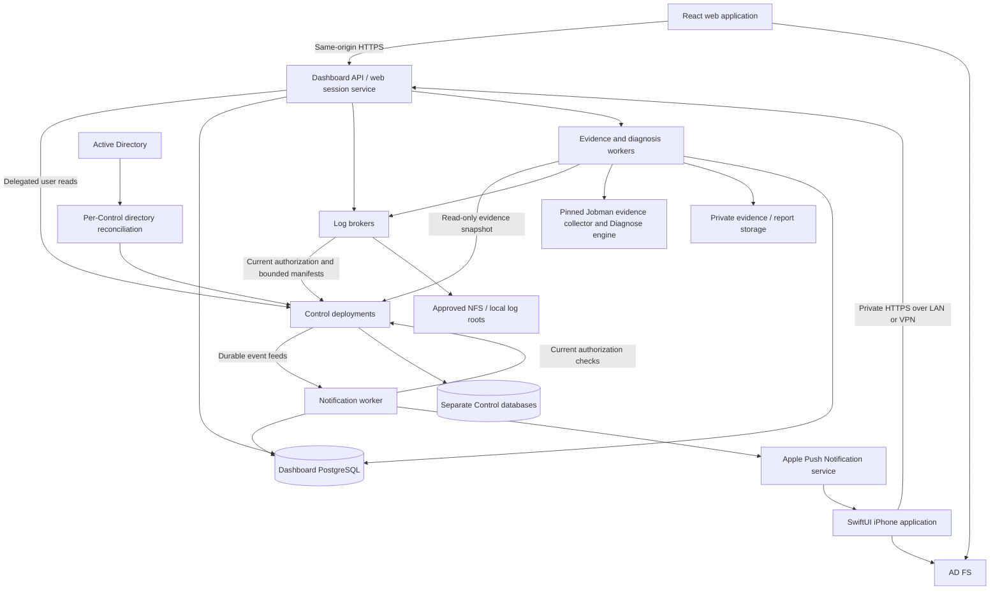

# Jobman Dashboard first-release design

Status: Proposed design 0.2 — development model and device ownership recorded  
Updated: October 3, 2026  
Product decision owner: Ryan Wallace  
Scope baseline: [Requirements draft 0.5](REQUIREMENTS.md)

This design covers the complete first release: a private web application and a native iPhone application for monitoring one or multiple Jobman Control deployments. It includes the required changes in Jobman Control, core Jobman, and Jobman Diagnose, as well as Dashboard services, clients, installation, testing, and operations. It describes work to implement; it does not claim that the proposed APIs or services already exist.

The recommended implementation is a Go application service and workers, PostgreSQL for Dashboard-owned state, a React/TypeScript web client, and a Swift/SwiftUI iPhone client. Both clients use the same Dashboard API. Each Control deployment remains authoritative for its jobs and namespace permissions. Dashboard combines authorized results, delivers log bytes, produces read-only diagnosis reports, and maintains personal alerts and preferences.

Product decisions in the requirements are binding. Technology selections, numeric engineering defaults, and new contracts below are design proposals. Ryan and Codex will develop together, with Codex performing most hands-on implementation (D14). Production targets company-managed iPhones; Ryan's unmanaged personal phone is available for testing (D18). APNs ownership/connectivity, internal distribution, pilot timing, hosting resources, and production maintenance ownership remain open. These inputs gate specific integration, planning, and release milestones while backend and client development can proceed.

## 1. Release boundary and design principles

The release includes all of the following in both clients:

- AD FS sign-in; direct AD group mappings; exact permission unions; access changes during existing sessions.
- Namespace views, deployment aggregates, and aggregates across deployments, with independent source failures and explicit completeness.
- Job inventory, detail, lifecycle and observation freshness, NFS/local logs, artifact metadata, and target configuration.
- Collection and Slurm array catalogs, child/task navigation, dependency graphs, and diagnosis reports with validated citations.
- Watched-job, all-own-job, and namespace alert rules; configurable terminal outcomes; per-device controls; durable 30-day notification history; background iPhone alerts.
- Accessible web and iPhone interfaces, private/VPN connectivity, internal iPhone installation and upgrades, and operating documentation.

The monitoring surface cannot submit, cancel, rerun, pause, or otherwise alter execution, regardless of the user's broader Control permissions. Personal settings, subscriptions, notification read state, and requests to generate a read-only report are Dashboard mutations. Group administration, target administration, utilization/capacity monitoring, standalone connectors, artifact downloads, S3 log delivery, AI-provider invocation, and a native iPad experience remain outside v1.

Four invariants apply throughout the implementation:

1. Every resource has a deployment-qualified identity, and every access is authorized against that deployment's current namespace grants.
2. Execution state, cancellation intent, scheduler evidence, observation confidence, and client connectivity remain distinct facts.
3. Incomplete, stale, unavailable, and unauthorized data cannot become zero counts, successful outcomes, or healthy targets.
4. A client presentation, cached report, event, or storage path never supplies authority to read a resource.

## 2. Architecture and implementation baseline



Everything except APNs runs on the private network. APNs requires approved outbound connectivity; it does not require a public inbound Dashboard route. Browser and phone never receive Control database credentials, storage credentials, APNs keys, or the log reader's OS identity.

### 2.1 Components and responsibilities

| Component | Implementation and responsibility |
| --- | --- |
| Dashboard API | Go HTTP service. Serves the compiled web application and `/api/v1`; manages web sessions; validates native credentials; queries Controls; composes views; authorizes access to Dashboard-owned records. |
| Source adapters | One configured adapter per Control deployment. Enforce endpoint/trust/version policy, delegate user identity, normalize transport envelopes without changing source semantics, and isolate retries and cursors. |
| Dashboard workers | Go processes sharing Dashboard PostgreSQL: source-event ingestion, rule evaluation, APNs delivery, report generation, and retention. Separate process modes permit independent deployment and credentials. |
| Log broker | Go service, colocated with accessible NFS mounts or the host holding local logs. Runs as the agreed ACL-enabled reader; validates Control authorization and manifests before bounded file reads. Deploy additional brokers where storage locality requires them. |
| Evidence/report integration | Core Jobman owns factual collection and sealing; Diagnose owns interpretation. Dashboard schedules work, supplies authorized readers, stores immutable results, and serves validated reports. |
| Control extensions | Direct-group grants and capability union, delegated read trust, discovery, monitoring queries, bounded group/log metadata, event feed, and shared diagnostic snapshots. |
| Web | React + TypeScript, Vite build, explicit route and query layers, semantic HTML, CSS design tokens, and bounded list/log/graph rendering. No separate Node server is required in production. |
| iPhone | Swift + SwiftUI, structured concurrency, system authentication, URLSession, Keychain, and UserNotifications. No web-view application shell. |
| Durable storage | PostgreSQL for Dashboard state and queues; private filesystem/NFS for sealed evidence and reports. No Redis, message broker, Kubernetes, or external object service is required for the initial topology. |

Go matches the existing services and allows reuse of public protocol/validation packages. A client-rendered web app suits a private authenticated application with a separately defined API; routing, query caching, accessibility, and error recovery are explicit work, since a build tool does not supply them. React documents this [build-tool approach and its tradeoffs](https://react.dev/learn/build-a-react-app-from-scratch). Pin exact supported compiler and dependency versions during scaffolding and commit lockfiles; this document does not select an unverified “latest” version.

Use a checked-in OpenAPI contract for Dashboard and generate transport models/clients for TypeScript and Swift. Keep application models separate so unknown status values, partial results, and authentication recovery are handled deliberately. Swift's [OpenAPI Generator](https://www.swift.org/blog/introducing-swift-openapi-generator/) supports generated clients and URLSession integration. Go server validation and domain authorization remain handwritten and tested.

### 2.2 Repository layout to create

```text
jobman-dashboard/
  api/                         Dashboard OpenAPI and shared example responses
  cmd/jobman-dashboard/        API, worker, migrate, and configuration-check modes
  cmd/jobman-log-broker/       Storage-local read service
  internal/
    auth/ sources/ monitoring/ logs/ reports/
    notifications/ preferences/ store/ operations/
  web/                         React application and browser tests
  ios/                         Xcode project, Swift packages, tests, signing templates
  contracts/                   Pinned generated clients and compatibility manifests
  testdata/                    Synthetic source, evidence, role, and failure fixtures
  deploy/                      Container/systemd examples and configuration templates
  docs/                        Requirements, design, setup, operations, release runbooks
  assets/                      Existing Dashboard SVG branding
```

Keep Control SQL and authorization in `jobman-control`; publish portable evidence/protocol changes from `jobman`; keep analyzers and report validation in `jobman-diagnose`. Dashboard must not import another repository's `internal` packages or directly query a Control database. Consume released module versions and reproducible contract snapshots; sibling checkouts are not a production build dependency.

## 3. Identity, authorization, and revocation

### 3.1 User authentication

Register a confidential web client, a public native client, and a Dashboard API resource in AD FS. Configure the API's audience and an immutable directory identity claim. Use authorization code flow with PKCE, state, nonce, exact redirect URIs, and an allowlisted issuer. Microsoft documents AD FS PKCE support beginning with Windows Server 2019; verify the deployed server and real token shape before selecting libraries and completing the registrations. An older or incompatible installation requires an approved upgrade/configuration solution, not an implicit fallback to password collection. See [AD FS flows](https://learn.microsoft.com/en-us/windows-server/identity/ad-fs/overview/ad-fs-openid-connect-oauth-flows-scenarios).

For the web, the Go service completes the code exchange and retains tokens server-side. The browser receives a random, revocable `Secure`, `HttpOnly`, `SameSite=Lax` session cookie. Store only a hash of its session identifier; encrypt any retained OAuth refresh token with an external key. Rotate the session on authentication. Validate CSRF tokens and Origin on every cookie-authenticated mutation, including settings, device management, and report requests. OAuth callbacks validate state separately. Do not put bearer credentials in browser storage.

For iPhone, use `ASWebAuthenticationSession` and a maintained OAuth client compatible with the verified AD FS configuration. The public client holds no client secret. Keep refresh credentials in a device-only Keychain item accessible while unlocked; keep API access tokens in memory where possible. Present a Dashboard-audience access token to Dashboard, and renew or prompt through AD FS according to its policy. Native API calls use bearer authentication, not web cookies. Apple's [system authentication session](https://developer.apple.com/documentation/authenticationservices/aswebauthenticationsession) and [RFC 8252](https://www.rfc-editor.org/rfc/rfc8252) guide the flow.

Dashboard validates the access token's signature, issuer, intended API audience, expiry, authorized client, and required identity claims. ID tokens establish sign-in identity at the appropriate client; they are not API credentials. Control's current OIDC verifier is an integration starting point, not proof that its token-type assumptions match the deployed AD FS configuration.

Maintain a Dashboard account UUID linked to verified `(issuer, subject)` aliases and the immutable AD object identifier. AD FS subjects may differ between clients/resources: join accounts only through the approved, signed directory identifier and a verified mapping to Control's principal. Never merge by email, display name, or a client-supplied GUID. Preserve existing Control principal/owner IDs during migration, and audit alias additions and conflicts.

Web defaults are an eight-hour absolute session and a 30-minute idle timeout, subject to a shorter IdP policy. Native access/refresh lifetimes follow AD FS policy. These are authentication controls, not scheduled expiry of namespace grants. Losing an interactive token does not delete subscriptions; background delivery is governed by current directory authorization and the user's device/subscription settings.

### 3.2 Dashboard-to-Control delegation

Introduce an explicit **read-only service delegation contract**. This is new Control work, not an existing admin token or an assumption that AD FS supports every desired token-exchange flow.

Each Control registers a Dashboard service identity, its client certificate, a pinned signing key, and an allowlist of namespaces and read operations. For a user read, Dashboard sends a short-lived signed actor assertion over mTLS containing the trusted directory/principal identity, destination Control instance/audience, operation class, issue/expiry times, unique assertion ID, and whether the actor is interactive or a named background worker. Bind the assertion to the presented service certificate; proposed maximum assertion lifetime is 60 seconds. Validate with a maintained JWT library, explicit algorithm/key selection, clock-skew bounds, and key rotation support.

Control authorizes a delegated read only when all three checks pass:

```text
registered service permits this operation and namespace
AND the asserted user's current Control grants permit the requested read
AND Dashboard's monitoring-only operation allowlist permits it
```

All checks run in the repository authorization path. Reject service actor assertions on execution/admin mutation endpoints even if the represented user is a namespace administrator. Do not expose a general proxy route that forwards arbitrary methods or URLs. Audit both the service identity and represented user. The browser and phone cannot mint assertions or choose the backend actor.

This deliberately trusts Dashboard to authenticate users and workers, while preserving Control as the authorization authority. A compromised delegation key is a significant read-access risk; scope keys by source, separate event/report/log worker credentials where useful, and support immediate service disablement and rotation. Review this trust boundary during the integration proof. AD FS on-behalf-of tokens could replace the assertion mechanism if proven operationally preferable, but v1 must not depend on unverified OBO support or offline per-user refresh tokens.

A separate service capability permits reading a minimal event feed for configured namespaces. It reveals event/resource IDs, owner identity, terminal outcome, and timestamps, without commands, log contents, or job names. It cannot serve user detail. Notification and report workers must still perform current represented-user authorization before producing or delivering user-visible data.

### 3.3 Direct group grants and exact permission union

Add per-Control directory reconciliation using an approved read identity over authenticated, encrypted directory transport. Configure dedicated group object IDs, each bound one-to-one to a namespace-scoped role. Stable IDs survive group renaming. Read explicit direct members of each mapped group; do not use recursive group expansion, transitive token groups, or nested-group claims. Dedicated role groups must use explicit membership, not primary-group semantics.

Resolve user objects and account eligibility. Fetch all directory pages and attribute ranges before considering a group snapshot complete. A truncated or failed query is not an empty membership list. Microsoft documents [range retrieval for multi-valued attributes](https://learn.microsoft.com/en-us/windows/win32/adsi/attribute-range-retrieval). Foreign-domain members require an explicitly configured and tested identity resolver; unresolved identities grant nothing and generate an operator diagnostic.

Replace the single `memberships.role` authority with contributing grants:

| Control record | Purpose |
| --- | --- |
| `principal_aliases` | Verified sign-in aliases mapped to the existing principal and immutable directory identity. |
| `directory_role_bindings` | Group ID, namespace ID, role, mapping revision, enabled state. |
| `membership_grants` | Principal, namespace, role, provenance/binding ID, reconciliation generation, and audit timestamps. No grant expiry field. |
| `authorization_versions` | Namespace/principal capability revision and last complete authoritative directory verification. |
| `directory_sync_state` | Checkpoints, source identity, complete snapshot timestamps, and failure/eligibility state. |

Compute capabilities as the set union of every applicable role grant in the same Control namespace. All four current member roles receive the required monitoring capabilities: namespace/jobs/groups/targets/artifact metadata/logs/evidence/report reads and read-only diagnosis requests. Preserve existing Control submit/operate/admin semantics through an explicit role-to-capability catalog, including owner-dependent cancellation checks used by other clients. Migrate every direct singular-role comparison, not only `authorizeNamespace`. No role ordering substitutes for a union.

Convert existing membership rows to audited `legacy/manual` grants for compatibility, then explicitly reconcile the pilot's managed namespaces to AD authority. A migration report must identify legacy grants that would otherwise survive AD group removal. The production AD-managed namespace policy disables or removes those unapproved grants before launch. Retain any operator recovery mechanism separately from ordinary Dashboard access and audit its use. The existing membership PUT operation cannot silently overwrite the entire grant set; version or redefine its provenance-specific behavior and update administrative clients.

Reconciliation performs directory I/O outside database transactions, validates completeness, then atomically changes grants, increments authorization versions, and records audit events. A complete group deletion or verified member removal revokes its grant; transport failure does not. Removing one role preserves permissions supplied by other roles. Deleting/disabling an account prevents background delivery as well as interactive access.

### 3.4 Revocation and directory failure behavior

Proposed defaults: reconcile mapped groups every 30 seconds, and target access removal within 60 seconds after the change is visible to the configured directory endpoint. Measure AD replication delay separately. These targets need validation against the actual directory; they do not promise instantaneous global AD convergence.

Each sensitive Control read checks current grants. Bootstrap responses include authorization versions and `authorizationCheckedAt`; Dashboard never uses an old capability cache to permit a request. Poll active client authorization on the regular five-second refresh cycle. On revocation, cancel affected in-flight view work, purge that scope's memory caches and pending routes, remove scoped content from inbox responses, and reevaluate alert rules. Long log following uses repeated short authorized requests, not an indefinitely authorized stream. Recheck report access when results are retrieved and before serving citations.

During a directory outage, retain the last complete grant records and show authorization health separately. After 120 seconds without a successful authoritative verification, reject affected sensitive reads and defer notifications with `authorization_unavailable`; do not delete grants or present a fabricated denial. Refreshing a stale token or assertion cannot extend this limit. Recovery requires a complete directory verification. This is a fail-closed freshness limit on authorization evidence, not timed removal of an access grant.

Clients may retain stale in-memory content only within that authorization freshness window. If the window expires while disconnected, clear sensitive views until authorization can be revalidated. Clear on account/source change, sign-out, and app relaunch; conceal job/log content in iOS task-switcher snapshots. Information already seen, copied, or delivered cannot be remotely recalled.

Queued APNs work is checked against current access and active device binding immediately before handoff. A removal concurrent with an external handoff cannot retract an accepted push; the generic payload and mandatory authorized detail fetch limit disclosure. Offline sign-out clears local credentials/content immediately, queues device unbinding using a narrowly scoped revocation credential, and reports that server-side unbinding will complete on reconnection. Test this limitation explicitly rather than promising unreachable servers receive a logout.

## 4. Source registry, identities, and API conventions

Operators configure one or more Controls; ordinary users select among authorized sources. The registry contains a stable Dashboard `deploymentId`, display name, expected Control instance ID, private HTTPS endpoint, trust roots, accepted API contract range, delegation audience/key references, allowed namespaces, log-broker/store mappings, and configuration revision. Secrets are references to protected files or the organization's secret store, never literal values exported to clients.

A deployment ID cannot be reassigned to a different Control instance. An endpoint move is allowed only after the expected instance identity is verified. A restore changes a recovery epoch, invalidating cursors and freshness assumptions while preserving resource identity. A replacement Control gets a new registry identity. Resolve outbound URLs only from this allowlist, disable cross-host credential forwarding and unapproved redirects, and bound DNS, TLS, request, and body processing.

Canonical references are structured values, not names concatenated ambiguously:

```text
JobRef      = deploymentId + namespaceId + jobId
RunRef      = JobRef + runId + runNumber
GroupRef    = deploymentId + namespaceId + collectionId or graphId
EvidenceRef = JobRef + source revision + core evidence ID
ReportRef   = EvidenceRef + analysis evidence ID + report ID
```

Namespace IDs are immutable source UUIDs; names are labels and existing Control URL selectors. The adapter resolves the authorized name required by older routes. Preserve original job/run/report/evidence identifiers inside envelopes. Cache and cursor keys also include account ID, query, source instance/recovery epoch, and relevant authorization version. Identical names and job IDs across Controls never collide.

Use UTC RFC 3339 timestamps on the wire and explicit display timezone in both clients. Encode potentially 64-bit revisions, offsets, sequences, and counts safely for TypeScript, preferably decimal strings in Dashboard contracts. Treat opaque source cursors as opaque. Page default is 50, hard maximum 200; all lists, child lists, manifests, report lists, and inbox queries have bounds.

Responses identify request ID, source, data-as-of time, last successful fetch, and completeness. Aggregates include per-source/namespace availability and observation times. Error codes distinguish `unauthenticated`, `forbidden`, `authorization_unavailable`, `not_found_or_inaccessible`, `source_unavailable`, `unsupported_contract`, `cursor_expired`, `storage_unavailable`, `invalid_evidence`, and `rate_limited`. Clients show useful recovery text without leaking internal paths, raw claims, or unauthorized resource existence.

Use 401 for expired/missing authentication, 403 for known scope denial, 404 for indistinguishable absent/inaccessible resource lookups, 409 for expired query/cursor state, 422 for invalid user settings, 429 with Retry-After for limits, and 503 for unavailable authority/storage. Aggregate responses can be 200 with explicit `partial` status; they cannot replace a failed contribution with zero. If no contribution succeeds, return an unavailable result with source diagnostics appropriate to the user's known authorized scope.

## 5. Control contracts and monitoring semantics

### 5.1 Required API additions

The following are proposed operations, to be authored in OpenAPI before client implementation. Names can be refined during contract review, but every capability is required. Existing `/v1` paths may remain; publish explicit contract negotiation and a `jobman.control/v1alpha2` capability manifest for the coordinated release. Keep existing agent protocol versions unchanged unless an actual wire change requires a new version. A current `v1alpha1` source is not silently considered a complete v1 Dashboard source.

| Control surface | Required contract/work |
| --- | --- |
| Capabilities and identity | Discover API/schema versions, Control instance ID, recovery epoch, supported monitoring features, limits, and service time. Return only non-sensitive capability metadata before authentication. |
| `GET /v1/me` | Verified principal/owner identity, authorized namespaces with immutable IDs, contributing roles, effective capability union, authorization version/freshness, and read-service capabilities. |
| Namespace and monitoring summaries | Authorized complete counts by phase/outcome, selected completion window, confidence attention flags, missing completion-time count, and source snapshot time. Permit a bounded batch of authorized namespaces per Control. |
| Job queries and detail | Add outcome/completion-time/owner filters, immutable submitting principal, truthful lifecycle timestamps with provenance, current run/execution references, group/node associations, and stable keyset pagination. Support the same filters in bounded multi-namespace monitoring queries. |
| Run selection | A bounded run reference list and detail sufficient for selecting logs/evidence; no full historical event-timeline UI is implied. |
| Collections/arrays | Catalog with complete summaries, bounded child/task queries, exact array index-to-child mapping, configured concurrency/failure policy, and scheduler identity when observed. |
| Graphs | Catalog, complete summary, bounded node/dependency pages, node lookup, and a bounded neighborhood operation. Expose source-computed readiness, predicates, observed upstream results, and dispositions. |
| Targets and artifacts | Bounded lists and detail, preserving configured state and metadata. No inferred target heartbeat or artifact download URL. |
| Log manifests | Stream summary, bounded tail/range chunk lookup, and continuation by execution/stream/sequence/offset. Current whole-manifest reads must not force downloading a large stream's complete history. |
| Diagnostic snapshot | Authorized transactional metadata snapshot for a selected job/run/revision plus bounded manifest references and evidence provenance. Specified jointly with core Jobman's new shared evidence collector. |
| Service delegation and authorization checks | Validate read-service identity and represented user; batch-check specific event/resource access without disclosing unauthorized resources. |
| Event feed/checkpoint | Durable ordered feed with stable event IDs, recovery epoch, cursor, retained lower bound, head checkpoint, source clock, and explicit retention-gap response. |
| Directory/admin integration | Provenance-aware grant reconciliation and audit; updated administrative membership contract. No membership editor is added to Dashboard. |

Legacy clients must have an explicit compatibility path: continue their existing single-grant operations for unmanaged namespaces, or receive an actionable managed-namespace error. Never serialize several roles as a misleading single highest role. Publish the tested old/new client behavior and migration procedure with the Control release.

Control implementation includes forward-only migrations, repository interfaces, SQL indexes, handlers, authentication/authorization changes, request and response validation, generated examples, and tests. Preserve historical migrations and regenerate copied portable contracts from their owning Jobman source. New directory calls, log reads, and network requests must occur outside Control database transactions.

### 5.2 Factual job model and counts

Control already stores `owner_principal_id`; expose and map it rather than deriving ownership from a name. For imported history, distinguish the importing principal from the original submitter if the latter is unknown. Imported records without a verified original owner must not match “all my jobs” merely because that user imported them. Collection children and graph nodes inherit the authoritative submission identity according to their source contract.

Persist execution-start and completion observations from authoritative events, including observed time, recorded time, and provenance. Control already has a `completed_at` field for imported history; extend/populate lifecycle fields for ordinary execution through explicit transitions. Do not backfill `startedAt` or `completedAt` from arbitrary `updatedAt`. Backfill only from reliable retained events/import evidence and mark unknown history explicitly. Expose scheduler-native IDs and timestamps separately from Control timestamps. Agent changes are required only where an essential fact is not currently emitted; audit current events before extending the portable protocol.

| Display/count | Definition |
| --- | --- |
| Active jobs | Every job whose Control phase is nonterminal. Child/node jobs are ordinary jobs; group wrappers add no jobs. |
| Awaiting reported execution | Subset in `accepted`, `assigning`, or `accepted_execution`. Label clearly; this does not establish exact scheduler queue occupancy. |
| Running | Control phase `running`, with separate observation-confidence indicator. |
| Terminal results | Jobs completed in the selected half-open UTC interval `[from, to)`, grouped by reported outcome. Default interval is the preceding 24 hours. |
| Unsuccessful preset | `failure`, `timed_out`, `aborted`, and `lost`; cancellation is a separate selectable outcome. |
| Evidence attention | Nonterminal jobs with `stale`, `uncertain`, or `lost` observation confidence. This can overlap active/awaiting/running counts. |
| Missing completion time | Separate count/detail explanation; do not place unknown dates into the last-24-hour bucket. |

Graph `blocked`/`skipped` dispositions remain visible and separate from scheduler state and the job's terminal outcome. Current unsatisfied graph nodes can have an `aborted` job outcome alongside their blocked/skipped disposition. Verify source implementation and OpenAPI enums together before releasing fixtures; do not coerce an unfamiliar outcome to failure. An “all terminal” alert matches terminal phase even if a compatible future source adds an outcome value; individual outcome filters match exactly. Clients retain and display unknown enum text safely.

Summary and drill-down queries share one definition of scope, filters, and time interval. Produce each source summary in one bounded transactional read. Counts describe the recorded snapshot time; a later live drill-down can change as jobs advance. Show that distinction rather than promising a transaction spanning several independent Controls. Complete group summaries and their returned child page share a source snapshot/revision where practical.

### 5.3 Aggregation and pagination

Dashboard asks each selected Control for its authorized namespaces, then uses bounded multi-namespace queries within that source. Aggregate totals sum the successfully returned contributions and display their completeness. Namespaces not authorized to the user are never part of a denominator, source breakdown, autocomplete, or notification count. A source timeout produces an explicit partial view with retry, while healthy sources remain usable.

For cross-source job/catalog lists, perform a k-way merge of source pages ordered by immutable creation time and stable IDs. Use deployment/namespace/ID as the deterministic final tie-break. The first request fixes per-source creation cutoffs so newly submitted work appears on refresh rather than being inserted into later pages.

Store a short-lived, account-bound browse session in Dashboard PostgreSQL: filter hash, selected source set, recovery/authorization versions, upstream cursors, unconsumed buffered rows, and the last emitted sort key. A random opaque cursor references that session. Retaining unconsumed buffers is essential; advancing an upstream page token without its remainder would skip jobs. Proposed session TTL is 15 minutes, with bounded rows/bytes and cleanup. Reauthorize on every page; purge/invalidate on permission, source-epoch, or query change.

Phase/outcome filters are live, not a frozen multi-source MVCC snapshot. Explain that matching rows can change during browsing and provide refresh. Keyset ordering prevents duplicate emission for an unchanged job identity; update the visible page with fresh details without silently shifting the user's scroll position. On a source failure, freeze the successful contributor set for that continuation and identify exclusions; retrying the missing source restarts the merged query. Do not splice a late source into already emitted pages and claim ordering remains complete.

Start with at most four concurrent source operations per aggregate, eight active calls per source, and a global bounded request pool. Use separate interactive and worker budgets so a large graph, log viewer, or event backlog cannot starve normal pages. Tune from the agreed load test rather than adding unbounded fan-out.

### 5.4 Refresh and freshness

Both clients refresh visible job/overview views every five seconds by default, allow manual refresh, prevent overlapping requests, and cancel obsolete scope requests. Settings permit manual-only or 5/10/30-second intervals within operator bounds. Hidden browser tabs and inactive iPhone scenes stop foreground polling. On return, validate authorization first and refresh current data.

Show `lastFetchedAt` independently from source `observedAt`, confidence, and scheduler timestamps. An HTTP success does not make stale execution evidence current. A failed refresh retains a clearly marked last-known view only while authorization freshness permits it. Retry transient failures with jittered backoff capped at 60 seconds; manual retry and reconnect bypass a scheduled delay without spawning duplicate requests. Do not blindly retry authentication/authorization failures.

## 6. Log and artifact delivery

### 6.1 Storage placement and trust

Deploy a log broker wherever it can reach the configured approved roots. A shared NFS mount can use one broker; logs held only on a workload host need a broker on that host or an explicitly provisioned read-only mount. Browser/iPhone access never assumes their filesystem can see those paths. Local storage coverage is an installation inventory item, not an automatic remote-file fallback.

Run each broker as the designated user with read and directory-traverse ACLs across workload users. Provision default/inherited ACLs for newly created directories and chunks, and mount read-only where feasible. Test NFS identity mapping, root-squash behavior where applicable, and logs produced after service installation. File-read permission does not grant namespace access.

Store mapping keys include deployment, target generation where required, logical store name, and mapping version. Pin each to a broker and approved root. Resolve objects only from an authorized Control manifest and the expected namespace/execution prefix. Do not accept a path, root, hostname, object URL, or store override from a client. Validate publisher ownership of that prefix; a checksum alone does not prove the object belongs to the requesting namespace.

Use directory-relative safe opens, reject symlink traversal and nonregular files, verify the opened file's metadata, and avoid check-then-open races. Limit read time, descriptors, bytes, and concurrency. A compromised/unavailable mount must not block the API's entire worker pool. NFS hard-mount stalls require process isolation and operator recovery, not only a Go context timeout.

### 6.2 Request and rendering flow

1. Client requests a specific source/job/run/stream and a tail or continuation cursor.
2. Dashboard delegates the current user's identity to the mapped broker. The broker verifies service trust and asks Control for current authorization and a bounded manifest range.
3. Broker safely opens each referenced immutable chunk, verifies full declared length and checksum, then emits only the requested range. Current Control chunks are bounded at 256 KiB; validate this against the negotiated contract.
4. Return ordered bytes with stream offsets, execution/run identity, capture time, next cursor, and explicit complete/truncated/missing/corrupt states. A cursor is a location, not a permission token.
5. Following repeats bounded requests while foreground, with authorization on every request and a final check before serving a prepared response. Revoke/cancel work when the scope changes.

Initial tail is at most 256 KiB per selected stream; each follow request is similarly bounded. Render at most 2 MiB in memory per visible log view, evicting older content with an explicit marker. Follow stays paused while the user reads earlier lines and resumes only on request or returning to the end. Search operates on loaded text and labels that limitation. Offer stdout and stderr separately; do not manufacture a total ordering between independently captured streams.

Preserve byte offsets in transport. Decode UTF-8 incrementally across chunk boundaries for display; handle invalid/binary bytes visibly without corrupting continuation offsets. Escape HTML, strip or visibly represent unsafe terminal controls, never execute ANSI/OSC hyperlinks or commands, and bound very long lines. Copy/export applies only to explicitly selected loaded text; no automatic persistent log cache. Responses are `no-store`, and operational logs never contain log payloads.

Distinguish “not yet captured,” empty complete stream, source truncation, rendered-buffer eviction, missing file, corrupt chunk, inaccessible mapping, and lost authorization. Retry transient absence of a newly published NFS chunk only within a bounded window; never silently skip a sequence gap. A run/execution change creates a new stream identity and cannot append into the old view.

Artifact views list authorized name, size, checksum, publication time, and availability metadata. No download button or storage URL is presented in v1. The metadata endpoint must also be paginated/bounded; inaccessible metadata is an error state, not an empty list.

## 7. Collections, arrays, graphs, and targets

Collection/array catalog rows show source, name/ID, creation time, aggregate state, total children, and complete child-outcome counts. Detail adds concurrency/failure policy and a bounded child table. Arrays preserve exact Slurm array identity and task index, including sparse indices; array indices are never inferred from page position. Child rows open ordinary job detail, logs, and reports. An array optimization in the scheduler does not collapse individual Jobman job identity or authorization.

Graph catalog rows show complete counts, including waiting, active, terminal, blocked, and skipped. Detail offers two equivalent investigation paths: a bounded graph neighborhood and an accessible paginated node/dependency list. Selecting a node shows the underlying job, incoming/outgoing dependency predicates, source-reported satisfaction, and missing/unsatisfied prerequisites. Control evaluates readiness; clients do not implement a competing execution engine.

Start with at most 200 rendered nodes and 500 visible edges. Large graphs open a summary and selectable neighborhood, with explicit omitted-node/edge counts and paginated expansion. Use a deterministic layered DAG layout computed off the main UI thread; cancel obsolete layout work. Native graph gestures must coexist with VoiceOver and list navigation. All nodes remain reachable through bounded list pages even when visual limits apply. Test the currently supported source ceiling of 10,000 nodes and 100,000 edges without downloading/rendering them all at once.

Graph and collection wrappers do not count as additional jobs in organization totals. Cross-Control views combine catalogs and summaries; a graph retains its original Control authority and boundary. No cross-Control dependency creation or group editing is introduced.

Targets show configured state (`active`, `draining`, `disabled`, `retired`), provider/backend, generation, and advertised capabilities. Label enabled/configured state explicitly. Agent liveness, fleet health, cluster capacity, and CPU/GPU/memory utilization are deferred; do not infer them from target configuration or the global metrics endpoint.

## 8. Shared-job evidence and diagnosis

### 8.1 Contract and ownership changes

Diagnosis is a required functional path, not a placeholder tab. The current core evidence contract is oriented around a local store, and Diagnose's deterministic engine is an internal package. Implement the following coordinated changes:

- In **Jobman**, publish a versioned shared diagnostic snapshot contract and a public, model-independent shared collector accepting metadata/log reader interfaces. It must work without manufacturing a local SQLite job or changing shared IDs.
- Introduce **evidence schema 2** for explicit source kind and shared provenance: Control instance/deployment, namespace, job revision, real run UUID/number, execution identity, snapshot consistency, and collector/source versions. Retain schema-1 decoding and fixtures. Do not overload schema 1's local store version or change the meaning of an existing fact code.
- In **Control**, implement a transactional bounded snapshot of the selected job/run and factual scheduler/lifecycle/dependency observations, with log-manifest references. Do external byte collection after the metadata transaction and label its consistency separately.
- In **Diagnose**, accept the new evidence schema, provide shared-job deterministic analyzers, and publish a supported deterministic library entry point implementing the public `Diagnostician` interface. Dashboard must not import `internal/engine`. Extend report/provenance validation for shared source identity; version the report format if adding that identity changes sealed semantics. Keep schema-1 standalone reports readable.
- In **Dashboard**, inject authorized Control and broker readers into the core collector, queue bounded deterministic work, validate and persist the exact evidence/report pair, and expose authorized report/citation APIs.

Prefer existing published event facts and immutable log chunks. Do not add a general “run a command on the agent” diagnosis RPC. If a missing fact is essential to a supported analyzer, add a narrowly typed factual agent observation through the owning portable protocol, with compatibility and rollout tests. Host telemetry and arbitrary filesystem/source-code collection are not prerequisites for the initial report path.

### 8.2 Report workflow

The job's Diagnosis tab lists available reports and freshness. “Generate report” requests deterministic analysis of a selected run/revision and clearly states the evidence disclosure profile. Default profile is metadata and scheduler/lifecycle facts; an explicit include-log-tail option adds bounded log text. Commands, paths, environment values, source files, and model/provider calls are excluded from the default workflow. Record the selected profile as part of evidence and cache identity.

1. Authorize the user and selected job/run; deduplicate identical pending requests.
2. Read the source metadata snapshot and bounded referenced log tails, applying core redaction and omission rules. Record capture time, source revision, original offsets, selected bytes, truncation, and missing facts. Never substitute fabricated observations.
3. Core seals the immutable evidence bundle. Diagnose validates it, derives attributed enrichment, runs only deterministic analyzers, and seals the report.
4. Verify report identity and `ValidateAgainstEvidence`-equivalent provenance/citation checks against the exact sealed evidence. Invalid or oversized output fails the request and is never rendered as a trusted finding.
5. Atomically publish report metadata after private object persistence succeeds. Recheck authorization before returning the result or any citation bytes.

Use explicit states `absent`, `queued`, `collecting`, `analyzing`, `ready`, `failed`, and `outdated`. New source revision, run, relevant manifest state, or collector/analyzer version makes an old report potentially outdated; compare provenance rather than elapsed time alone. An old report remains a report about its recorded snapshot, clearly labeled. Historical imported jobs or disconnected agents may legitimately yield missing-evidence findings; they must not appear to have execution facts that were never recorded.

Cache by source-qualified subject, evidence identity/disclosure profile, and engine/contract version. Report deduplication may share an immutable object within the same authorized namespace, but access is always rechecked for the caller. Store original evidence/report IDs unchanged inside a deployment-qualified envelope. A citation resolves only to bytes/items in that exact evidence object, not to whichever current log has the same path or offset.

Initial worker limits: two analyses concurrently per worker, one pending equivalent request per subject/profile, a 60-second task timeout, and explicit queue limits. Keep the existing 2 MiB report/depth-32 decoding bounds unless a reviewed schema requires a tighter limit; set and record bounded evidence/log budgets before sealing. Failed tasks have bounded retries for transport failures and no retry loop for invalid evidence. Cancel queued work after permission loss; discard inaccessible results from the user's view.

A proposed 30-day cache lifetime covers sealed reports and the evidence needed for their citations; delete them together with safe reference counting. This is a new cache default to validate with the operator, distinct from the accepted 30-day inbox retention and source-owned job/log retention. Source deletion removes user access immediately; cache cleanup follows policy. Do not retain citation-bearing reports after deleting their required evidence and still claim they are verifiable.

Both clients present severity, finding, confidence basis, supporting/contradicting evidence, missing evidence, suggested actions, retry advice, versions, and disclosure provenance. Explain that a confidence score is analyzer output, not a calibrated success probability. Advice is text; no job-control action runs from it. Existing reports containing optional generated hypotheses may be displayed only after the same validation and explicit labeling. Opening or generating a v1 Dashboard report never starts an AI-provider request.

## 9. Durable events and notifications

### 9.1 Source event production and consumption

Extend Control's existing transactional outbox with versioned monitoring events. Each eligible terminal transition records a stable UUID, namespace/job/run references, authoritative owner, old/new phase, outcome, source revision, observed completion time, Control recorded time, and import/reconciliation flags in the same transaction as the job change. Ordinary metadata updates after completion do not emit another terminal transition. Collection/graph wrappers do not generate duplicate child-job notifications.

Implement a Control publisher that appends committed outbox records to a durable monitoring feed and marks them published in one short database transaction. Serialize feed-position allocation and publication with a transaction-held counter/lock so a cursor cannot pass an earlier uncommitted append. Do not treat an arbitrary bigserial allocation or outbox UUID ordering as commit order. Publication is internal database work; no HTTP/APNs call occurs inside that transaction.

Dashboard consumes each source independently and stores received events idempotently with a source checkpoint. Its transaction commits event insertion and checkpoint advancement together; a crash before commit causes replay. Separate rule-evaluation work permits the source feed to continue while APNs or a user's authorization is temporarily unavailable. Lease jobs with expiry and bounded retries; stale leases are reclaimable after a worker crash.

Deduplicate by `(deploymentId, Control instance ID, original event UUID)`. Preserve original event UUIDs across replay and source restore. Recovery epoch invalidates a cursor but is not an excuse to duplicate a retained event's identity. On restore or retention gap, pause normal continuation, rediscover authorization and source capabilities, reconcile available terminal state, and record an explicit monitoring gap. A snapshot cannot reconstruct every lost transition; do not claim complete alert delivery or flood users with synthetic historical notifications. Resume from an explicit new checkpoint, with late recoverable events labeled by their original times.

Propose 30 days of durable source-feed retention, independently configured from existing outbox cleanup and Dashboard inbox expiry. Publish backlog/oldest-event metrics and warn well before a consumer falls outside the retained range. Test reordering, replay, concurrent publication, source restart, checkpoint loss, and recovery epochs. Ordinary five-second job polling is not the notification event source: a job can start and finish between polls.

### 9.2 Rule model and matching

Each account owns versioned, opt-in rules with enabled state, source-qualified scope, terminal predicate, and a per-source activation checkpoint. The editor offers:

| Scope | Behavior |
| --- | --- |
| Watched jobs | Explicit job references, including other members' jobs within authorized namespaces. Watching can start from job detail. |
| All my jobs | Match the verified submitting principal in selected authorized source namespaces, including future jobs. Resolve identity separately for each Control. |
| Namespace jobs | Match every user's jobs in explicitly selected authorized namespaces across one or several Controls. |

Store explicit namespace selections, even when the UI offers “select all currently authorized.” A newly granted namespace or newly added Control is not an automatic subscription. Rules remain visible with inaccessible scopes disabled/redacted; grants do not resurrect delivery silently after a scope has been explicitly disabled by the user. A removed scope requires revalidation before reactivation.

Outcome configuration includes individual outcomes, the unsuccessful preset, successful completion, cancellation, and all terminal outcomes. Default is opt-in unsuccessful alerts; no rule is created merely by signing in. “All terminal” preserves future unknown terminal outcomes; unsupported individual values produce a visible compatibility message. Resource-usage and cluster-capacity alerts are deferred with their telemetry.

Activation captures a source feed checkpoint and source-clock `notBefore` time. Match subsequent eligible events recorded by Control after that boundary; this prevents an old unpublished outbox backlog from becoming a new subscription's historical alert flood. Completion observed earlier but first recorded after activation can still qualify. Exclude completed-history import and bootstrap reconciliation events. If a source cannot establish an activation boundary, show that rule scope as pending until it can; do not claim it is actively monitoring the outage period.

Retain rule versions and activation intervals long enough to evaluate delayed events consistently. Disabling a rule immediately suppresses its pending deliveries; editing a scope/outcome set creates a new activation interval. An event matching multiple active rules yields one inbox record per user/source event, with every matched rule recorded. If one matching rule is removed, other valid matches can still justify delivery.

### 9.3 Inbox and delivery pipeline

For each event, resolve candidate rules and verify the represented user's current namespace/account authorization. In one Dashboard transaction, insert the inbox item under a unique `(accountId, source event key)` constraint, attach matched-rule context, and enqueue eligible device deliveries. Unavailable authorization defers evaluation/delivery; confirmed lost access suppresses it. Recheck access and device/rule state immediately before APNs handoff and before every inbox/detail read. Count unread items only within currently authorized scopes.

Inbox entries retain source reference, original event time, outcome, match context, creation/read state, and delivery status. Sensitive job names are fetched on authorized display rather than copied into the push payload. Keep inbox/history entries for 30 days after insertion; subscriptions, source checkpoints, and deduplication state have separate lifecycles. Retain deduplication tombstones at least as long as the replayable event window so deleting an inbox item cannot create a duplicate notification on replay.

Each iPhone installation registers its APNs token, bundle/topic, environment, account binding, and delivery preference. Token changes update that installation rather than creating duplicate recipients. Validate the authenticated owner on registration, edits, and removal. Support a list of the user's devices and remote disablement from web or iPhone. Account switching explicitly detaches the prior binding. Keep test/production APNs identities and tokens separate.

APNs uses the visible alert notification channel. The server evaluates rules while the app is closed; there is no continuous iPhone polling or reliance on silent background pushes. Default payload is a generic message such as “A monitored job has an update,” plus an opaque inbox identifier and schema version. It contains no job name, command, namespace name, path, log excerpt, or reusable API credential. Opening it resolves the inbox reference after authentication and current authorization.

Delivery is at least once at the transport boundary. Record attempts, provider response IDs, retry timing, and permanent failures. Retry rate limits/transient failures with bounded backoff; disable invalid tokens; surface credential/topic failures to operators. A crash after APNs acceptance but before local acknowledgement can repeat a push; stable delivery IDs and collapse identifiers reduce duplicates but do not establish exactly-once OS presentation. Inbox uniqueness remains authoritative.

For old backlogs, keep inbox events but expire push attempts after a proposed 24-hour handoff window to avoid a notification storm on recovery. Short APNs expiry and aggregation of repeated attempts apply per inbox event, without silently merging distinct jobs. Users can mute this device independently of rule activity and other devices. OS denial of notifications leaves the durable inbox usable and is shown in Settings.

Apple's [remote-notification architecture](https://developer.apple.com/documentation/usernotifications/setting-up-a-remote-notification-server) defines the provider/device relationship. Verify organization egress against Apple's [APNs network guidance](https://support.apple.com/en-us/102266); receipt of a generic push while off VPN does not imply private job detail is reachable.

## 10. Dashboard API and durable state

### 10.1 Client-facing operations

All endpoints below are proposed under `/api/v1`, with `/auth/*` for authentication. No endpoint forwards arbitrary Control commands.

| Surface | Operations |
| --- | --- |
| Authentication/bootstrap | Web sign-in/callback/logout; native authenticated bootstrap; current account, authorized sources/namespaces, roles/capabilities, versions, operator limits, and authorization freshness. |
| Scope monitoring | Overview and job/catalog queries for a namespace, selected deployment, or selected deployment set; page/cursor and filter parameters; partial-source status. |
| Resource detail | Source-qualified jobs/runs, collections/children, arrays/tasks, graphs/nodes/dependencies/neighborhoods, targets, and artifact metadata. |
| Logs | Authorized tail and continuation reads by job/run/stream; explicit byte limit and opaque location cursor. |
| Diagnosis | Report list/detail, deterministic generation request, task status, and exact citation/evidence projection. Requests are idempotent and rate-limited. |
| Alert rules | List/create/edit/disable/delete personal rules; server validation of scope and predicate; revision-checked updates and per-source activation state. |
| Inbox | Bounded chronological list and unread count; authorized detail; mark read/unread. |
| Devices | Register/update token and notification status; list owned bindings; disable/remove a binding. |
| Preferences | Timezone, appearance, refresh setting, selected authorized scope, and notification defaults; revision-checked updates. |

Use one scoped route shape for detail, for example `/api/v1/deployments/{deploymentId}/namespaces/{namespaceId}/jobs/{jobId}`. The server independently verifies every identifier; embedding a namespace in a path is not evidence that a job belongs to it. POST report requests return 202 with a durable task ID or the existing equivalent result. Idempotency keys prevent duplicate work when mobile requests time out. Use ETag/revision conditions for settings and rule updates to avoid one client overwriting another client's edits.

### 10.2 Dashboard persistence

| Table family | Principal keys and invariants |
| --- | --- |
| Accounts and identity aliases | Account UUID; verified issuer/subject and directory object binding; uniqueness prevents accidental account merging. |
| Web sessions | Hashed random session ID, account, expiry/revocation, protected token references; no cleartext session bearer in DB logs. |
| Source registry state | Stable deployment/Control identity, configuration revision, recovery epoch, connection health; secrets remain externally referenced. |
| Preferences | Account plus global/source scope and revision. Store selected resource IDs only where needed and revalidate them on use. |
| Browse sessions | Account/query/source-version-bound cursors and bounded remainders; 15-minute TTL; sensitive server-side cache. |
| Rules, scopes, versions | Account owner, rule revision, source-qualified explicit selections, outcome mode, activation intervals. |
| Devices/bindings | Installation ID, owner, protected APNs token, environment/topic, delivery preference, revoked state. |
| Source events/checkpoints | Unique source event identity; per-source processing position, epoch, leases, and gaps. |
| Inbox, matches, delivery attempts | Unique user/event inbox record, matched rules, read state, device deliveries, attempt IDs and retry state. |
| Report tasks/objects | Source-qualified subject, selected evidence profile/revision, lease/state, content identities and private object references. |
| Audit records | Actor and action class for sessions, rules/devices, report requests, source config, and service delegation; no log content or bearer tokens. |

Dashboard does not maintain an independent authoritative job database. Event facts, browse buffers, and immutable evidence are explicitly limited projections. Any cached subject read still requires current Control authorization. Access to application-owned rows requires account ownership as well as source authorization where applicable.

Use forward migrations run by a separate migration identity. API/worker database users have only their needed runtime privileges. Commit queue state and application state together where required; perform APNs, directory, Control, and filesystem I/O outside SQL transactions. Persist immutable objects with atomic rename/checksum validation, then publish references; clean abandoned objects after a grace period. Never expose an incomplete object through a “ready” record.

## 11. Web and iPhone experience

### 11.1 Navigation and screens

The persistent scope selector offers a single namespace, all authorized namespaces in one deployment, or selected deployments with their authorized namespaces. Every detail view includes source breadcrumbs. Web uses a sidebar and URL-backed filters; iPhone uses Overview, Jobs, Workloads, Inbox, and More tabs, with Collections/Arrays and Graphs under Workloads and Targets/Settings under More. All required destinations remain directly reachable without reducing native scope.

| Screen | Required interaction and information |
| --- | --- |
| Connection/sign-in | Organization Dashboard address, private/VPN reachability, sign-in, expired-session recovery, and useful distinctions between network, identity, access, and version errors. |
| Overview | Scope/window controls, complete counts, distinct attention indicators, source completeness, and matching filtered drill-downs. |
| Jobs | Bounded newest-first results; phase/outcome/time/owner filters; exact ID lookup in the selected source scope; source and freshness labels; preserved list position. |
| Job detail | Identity, owner, labels, target/generation, group/node links, phase, desired state, outcome, scheduler observations, lifecycle provenance, and separate fetch/evidence freshness. Tabs/sections for logs, artifact metadata, and diagnosis; watch control. |
| Collections/arrays | Catalog, complete summary, policy, task indices, paginated children, and child investigation. |
| Graphs | Catalog, summary, bounded diagram and accessible node list; selected-node dependency detail and job links. |
| Targets | Configuration and advertised capabilities with explicit configured-state language. |
| Inbox | Current authorized history, read state, source/time/outcome, matched-rule context, and deep link into refreshed detail. |
| Alert editor | All three rule scopes, explicit multi-source namespace selection, outcome presets/individual selection, enabled/pending state, and device delivery controls. |
| Settings | Timezone, light/dark/system appearance, refresh bounds, account, roles/effective capability union, authorized connections, devices, notification permission, and sign-out. |

Every screen implements loading, true empty, filtered-empty, partial, disconnected/stale, denied, removed, incompatible, and recoverable-error states. Destructive job controls are absent from both the route set and API allowlist. Names/labels may wrap and IDs remain inspectable/copyable; status meaning does not depend on color alone. Reuse the existing SVG identity with consistent spacing, typography, focus, and status tokens.

### 11.2 Client implementation details

The web query layer uses account/scope-qualified keys, request cancellation, deduplicated polling, and explicit cache purge. Do not put API responses in a service worker, localStorage, IndexedDB, or HTTP caches. Cache only versioned public static assets. Use semantic tables/lists, keyboard navigation, visible focus, accessible errors, and route focus restoration. Verify the primary workflows against WCAG 2.2 AA, including graph-list and log-view alternatives.

The native app separates transport, authentication, repositories, presentation state, and SwiftUI views. Network/log/graph work runs outside the main actor; a scope/account change cancels old tasks before publishing their results. Use ephemeral URLSession caching behavior for sensitive APIs and Keychain for credentials. Persist benign preferences/connection configuration only; no Core Data/SwiftData database of jobs or logs is required. Native storage is not an offline monitoring feature.

Propose iOS 18 as the initial minimum development target, to be validated against IT's phone inventory and supported security/update policy before the pilot. Pin the release Xcode/SDK toolchain after the distribution channel is known. Web acceptance covers current and previous major Safari, Chrome, Edge, and Firefox versions selected at release cutoff. Responsive web includes tablet layouts; a native iPad layout is deferred.

Support Dynamic Type, VoiceOver, reduced motion, large touch targets, and light/dark appearance. Log text needs adjustable legibility and an accessible loaded-range summary. Preserve navigation and selection while refreshing; do not reset a reader to the newest row or scroll position on every poll.

### 11.3 Routes, private links, and reconnection

Web deep links use canonical source/namespace/resource IDs. Save only a validated relative destination through sign-in; reject external return URLs. Native APNs taps carry an opaque inbox ID, then fetch the authorized destination. Other native links use a registered application scheme with source-qualified IDs and no credentials; the app validates them against its approved Dashboard configuration. A web “Open in app” affordance and in-app handling of pasted canonical links provide a private-network baseline.

Universal HTTPS app links are an optional packaging improvement once the private-domain association and selected management channel have been proven. They are not assumed to work merely because VPN exists, and they do not justify publishing a private Dashboard endpoint. OAuth callback registration remains separate from arbitrary content links.

On an off-VPN push tap, show the generic event and a private-network connection explanation, retain its opaque destination, and retry after reachability/authentication returns. Never cache privileged job detail inside the notification payload to make this appear to work offline. Across account changes, resolve the route again under the new account rather than restoring the previous user's content.

## 12. Deployment, security, and operations

### 12.1 Initial topology

Provide documented Linux service/container packages for the Dashboard API and workers, a private PostgreSQL database, and storage-local log brokers. The API serves the web bundle behind an organization-managed HTTPS reverse proxy. Containers are optional where host UID/ACL integration makes a systemd service simpler. Kubernetes is not a prerequisite. A single API instance and worker set is the initial topology; database leases and durable queues allow safe restart and later multiple replicas without redesigning event ownership.

Maintain separate development, integration, and production configurations, AD FS registrations, database/storage locations, APNs environments, and signing identities. Ship a synthetic two-Control fixture environment for development. Configure deployment names, private DNS, trust roots, broker mappings, directory bindings, and feature/version policy through validated operator configuration with secret references. Reject invalid or duplicate source identities at startup. Restrict native connection setup to the organization's approved Dashboard addresses, supplied manually or through managed configuration if available.

The network inventory must cover browser/phone-to-Dashboard and AD FS, Dashboard-to-Control, broker-to-Control/store, Control directory reconciliation, private PostgreSQL/object storage, DNS/time synchronization, and provider/device-to-APNs. Validate both on-site and VPN routing, private certificate chains, proxy behavior, and certificate renewal. Do not require the phone to connect directly to every Control or NFS host.

### 12.2 Security implementation

- Serve production traffic only over verified TLS; use separate internal mTLS identities for delegated services. Scope database, directory-read, storage-read, report-write, and APNs credentials separately and document rotation/revocation.
- Use no-store API responses, restrictive CSP, frame protection, nosniff, safe referrer policy, output escaping, and same-origin web calls. Bundle production assets privately; no third-party script/CDN is required. CORS is unnecessary for the default browser topology.
- Validate lengths, enums, pagination/graph limits, uploaded settings, signed assertions, and source-qualified references. Rate-limit sign-in/session creation, report generation, logs, and subscriptions by authenticated account/source as appropriate.
- Protect metadata and logs against insecure direct object references, arbitrary file/URL reads, path traversal, source confusion, cross-account caching, role escalation, token replay outside its audience, and report citation substitution.
- Treat logs, names, labels, scheduler text, and reports as untrusted. Do not render their HTML, run a quoted command, automatically follow embedded URLs, or send them to a provider.
- Keep credentials out of access logs, URLs, crash reports, support bundles, and preference exports. Use opaque correlation IDs and safe error classes. Audit sensitive operations without copying job/log contents.

These controls protect private application data; they do not make arbitrary workload logs secret-free. Users with the confirmed namespace read capability can view all members' logs in that namespace. Storage ACL provisioning must match that intended operational model without broadening the end-user API boundary.

### 12.3 Observability and recovery

Expose separately restricted liveness, dependency readiness, and operator metrics. Source or directory degradation is visible without restarting a healthy Dashboard into a crash loop. Record API latency/error rate, source query latency, authorization freshness/revocation lag, feed lag and retained lower bound, worker queue age, delivery latency/failure, log verification failures, report failures, database/storage pressure, and configuration/version mismatches. Use bounded labels, not job/user IDs as metric labels. User views never consume global unauthenticated Control metrics as their namespace counts.

Provide runbooks for directory outage, AD FS key rotation, Control outage/restore, source identity replacement, revoked service trust, inaccessible/corrupt logs, stalled NFS, event gaps, APNs failure, report-store corruption, database restore, and phone certificate/VPN trouble. Every alert names an owner and a safe recovery action.

Back up Dashboard PostgreSQL, report/evidence objects, configuration, and recoverable secret/key material through the organization's approved system. Proposed starting recovery objectives are RPO 15 minutes and RTO four hours, to be accepted by the operator. Restore tests must exercise event replay, idempotency, renewed source authorization, report/object consistency, session invalidation where keys change, and device delivery. Put restored workers into a delivery hold until checkpoints and prior attempts are reconciled; do not send a backlog blindly after restoring an old database.

| State | Retention/default |
| --- | --- |
| Notification inbox | Accepted requirement: 30 days after insertion. |
| Source monitoring feed | Proposed: 30 days, independent of published-outbox cleanup. |
| Event/delivery deduplication and retired rule intervals | At least the source replay window plus a margin; initial proposal 35 days, extended when replay retention increases. |
| Browse sessions | Proposed: 15 minutes; purge promptly on access/account/source invalidation. |
| Evidence and report cache | Proposed: 30 days with paired deletion and storage quotas. |
| Sessions | Authentication expiry/revocation plus short bounded housekeeping delay; do not preserve usable expired credentials. |
| Audit/operational records | Proposed: 90 days of content-free audit records; operator may set a longer required period. |
| Source jobs, logs, artifacts | Remain governed by Control and storage policy. Dashboard's 10,000-job capacity target is not a deletion policy. |

Retention jobs are incremental, bounded, observable, and safe with active readers. Unknown pending-delivery outcomes, active object references, and live checkpoints cannot be deleted solely because another table's inbox retention elapsed.

### 12.4 Internal iPhone delivery

Create the iPhone bundle identity, entitlements, app icon/assets, signing configuration, APNs topic/environment, version/build numbering, archive/export automation, and install/upgrade instructions. Protect signing keys and profiles in an approved macOS build environment. Keep simulator/development builds reproducible before the production distribution channel is selected.

Production devices are company-managed iPhones. IT must identify the existing Apple program/accounts, approved internal channel, signing owner, and any MDM service. Apple's [business distribution options](https://developer.apple.com/business/get-started/) do not make “internal” synonymous with one program. Choose the actual channel before defining final signing/export settings; development/ad hoc installation is only an integration tool, not an assumed long-term distribution plan.

Ryan can test on a personally owned iPhone with no management controls. Use it for early native interaction, accessibility, authentication, and notification testing as the required signing, private-network access, and APNs credentials become available. Until then, simulator and fixture-backed testing can proceed. Track results from this device separately: final installation/upgrade and management-policy acceptance must also run on representative company-managed phones. The personal test device does not establish corporate VPN access or resolve APNs connectivity and ownership.

Release acceptance includes company-managed-device installation and upgrade, retained preferences with safe reauthentication, native AD FS sign-in over VPN, push receipt with the app closed, private deep links, notification denial, token rotation, sign-out/account switch, the organization's actual trust/configuration controls, and app removal. Assign signing, provisioning-profile, Apple account, and APNs key renewal owners. Native iPad testing is not part of this first release.

## 13. Validation and acceptance plan

### 13.1 Engineering targets

The accepted scale is 10 namespaces, 25 concurrent viewers, 500 active jobs, and 10,000 retained jobs per namespace, distributed first across one Control and then across at least two Controls. It is a total source-set baseline, with history measured per namespace. Use duplicate names/IDs across sources in fixtures. Real deployment sizing, total bytes, array size, event burst rate, and device count must be recorded in the test profile; job count alone does not bound them.

| Measure | Initial acceptance target |
| --- | --- |
| First useful authenticated list/detail | p95 within two seconds on agreed devices at network RTT up to 100 ms, excluding interactive IdP time. |
| Foreground freshness | Changes visible within ten seconds p95 after Control exposes them, using five-second polling. |
| Notification work | Persist an eligible inbox event and attempt APNs handoff within 30 seconds p95 after the durable source event is available and dependencies are healthy. Measure device presentation separately. |
| Revocation | Within 60 seconds after change visibility at the configured directory endpoint; stale authorization fails closed after 120 seconds without verification. |
| Job/group pages | Default 50, maximum 200; query plans/indexes measured at full history size. |
| Log view | Initial/follow response at most 256 KiB per stream; 2 MiB rendered buffer; bounded line length, decoding, and read workers. |
| Graph view | At most 200 rendered nodes/500 edges; bounded navigation through the full supported source graph size. |
| Diagnosis | Proposed evidence cap 2 MiB encoded and 1,024 facts; optional tails at most 64 KiB per stream; report cap 2 MiB/depth 32; 60-second worker deadline. Record omissions when limits apply. |
| Accessibility | WCAG 2.2 AA web workflows; keyboard/screen reader checks; VoiceOver, Dynamic Type, reduced motion, and adequate touch targets on iPhone. |

Measure source-level latency and aggregate rendering separately. Set HTTP deadlines so an unavailable source yields a partial useful view near the interactive budget rather than making users wait for every source timeout. Longer log/report operations expose progress and cancellation. Tune concurrency/defaults only with recorded measurements; do not claim these targets are already achieved.

### 13.2 Required test groups

| ID | Tests and release evidence |
| --- | --- |
| T01 Identity and trust | Real AD FS web/native code-PKCE exchange; correct API token type/audience; invalid issuer/key/client/expiry rejection; alias conflict; CSRF/session fixation; source-bound delegation and revoked service keys. |
| T02 Authorization lifecycle | Direct vs nested membership, multiple-role union, overlapping grants, last-grant removal, disabled account, incomplete LDAP ranges, legacy-grant cleanup, directory outage/recovery, active sessions/logs/reports/inbox, source isolation. |
| T03 Monitoring correctness | Overview/list filter agreement on a fixed dataset; truthful lifecycle times and imported owner semantics; unknown enums; cancellation intent vs outcome; stale observation vs failed fetch; unavailable counts and no group double count. |
| T04 Aggregation/pagination | One and multiple Controls; duplicate source IDs/names, equal timestamps, unconsumed-page buffers, mutable filters, permission/epoch invalidation, source timeout/recovery, bounded concurrency and no skipped stable rows. |
| T05 Logs and artifacts | Different workload users and newly created ACL-protected chunks; unauthorized namespace; traversal/symlink/nonregular file/prefix mismatch; corrupt/missing/gapped/rotated/truncated output; UTF-8 boundaries, binary and long lines; metadata-only artifacts. |
| T06 Workload groups | Actual collection and Slurm array, sparse task mapping, source-computed graph predicates/readiness/dispositions, 10,000-node/100,000-edge navigation, complete summaries and accessible alternatives in both clients. |
| T07 Diagnosis | Shared failed subprocess and Slurm fixtures; sealed source/run identity; active/outdated and imported/missing evidence; bounded logs/redaction; tampered/oversized/unknown schema; exact citation bytes; no command execution/provider network call. |
| T08 Events and rules | Transactional publication ordering, crash/replay/checkpoint recovery, all three scopes and outcome modes, current/future jobs, owner matching, activation boundaries, delayed events, edits/disable, overlapping-rule uniqueness, gaps and retention. |
| T09 Push and inbox | Real iPhone alert while closed; APNs retry/ambiguous acknowledgement/token rejection; denied/muted push with usable inbox; generic payload, off-VPN tap, device/account unbinding, access loss before send/open, 30-day expiry. |
| T10 Client behavior | All screens and error states, scope/account switches canceling old responses, list/scroll restoration, back/forward/routes, hidden/inactive polling, memory bounds, no persistent job/log data, accessibility and browser/device matrix. |
| T11 Scale/resilience | Accepted one/two-source load; simultaneous viewers/log follows/group drill-downs; terminal-event bursts; slow Control/NFS/AD/APNs/database; bounded queues, latency/freshness targets, process restart, migration and backup/restore drills. |
| T12 Packaging/operations | Clean reproducible builds, contract generation checks, fresh install and supported upgrade, secrets/config validation, internal install/upgrade on company-managed iPhones, TLS/VPN/DNS/APNs routes, documented credential rotation and operational ownership. Record earlier personal-phone development testing separately. |

Use synthetic fixtures and secret canaries for automated tests. Run Go unit/race and real PostgreSQL integration tests for backend changes; validate portable/evidence/report contracts against pinned fixtures. Add client state/transport tests and browser/XCTest workflow coverage where they establish behavior, with shared golden API examples across languages. Perform actual AD FS, NFS, Slurm, and APNs exercises in the approved integration environment; mocks cannot establish those infrastructure facts.

Record pass/fail evidence against these gates. Dashboard pilot success does not by itself satisfy Control's existing [production-readiness requirements](../../jobman-control/docs/PRODUCTION_READINESS.md). Production rollout needs those deployment-specific acceptance exercises and owners as well.

## 14. Implementation work packages

Each package includes implementation, contract/docs updates, and the corresponding validation above. This is the full v1 backlog at design level; milestones may demonstrate subsets, but no package containing an agreed feature is optional at release.

| Package | Repository / work | Completion evidence and dependencies |
| --- | --- | --- |
| WP01 Foundation and contract toolchain | Dashboard: Go module/process modes, PostgreSQL migrations, OpenAPI, generated TypeScript/Swift clients, React and Xcode scaffolds, branding, synthetic two-source fixtures, CI and version manifests. | Reproducible clean builds and fixture-backed shell screens; agreed API conventions. Starts first. |
| WP02 Authentication and service trust | Dashboard + Control: AD FS registrations/integration, web sessions/CSRF, native OAuth, verified account aliases, read-only delegation, per-source service trust and rotation. | T01 and a real browser/iPhone private-network sign-in; depends on WP01 and IT identity inputs. |
| WP03 AD grants and revocation | Control: forward migrations, role/capability catalog, directory reconciler, provenance and removal, all singular-role call sites, discovery/auth checks, managed-namespace migration/audit. | T02 with union/removal in active sessions and background worker reads; depends on identity mapping from WP02. |
| WP04 Monitoring read contracts | Control + Dashboard adapters: capability/instance discovery, owner and run metadata, lifecycle times, filters, complete summaries, bounded targets/artifacts, indexes, aggregation/cursors/freshness. | T03/T04 at accepted history scale; depends on WP02/WP03, with fixtures available earlier. |
| WP05 Groups and graph contracts | Control + Dashboard: catalogs, complete summaries, paginated children/nodes/edges, array index mapping, bounded graph neighborhoods, enum/contract reconciliation. | T06 API fixtures and actual Slurm group evidence; builds on WP04. |
| WP06 Log access | Control + Dashboard brokers: bounded manifests, source/store configuration, safe file reads/checksums, service authorization, ACL installation, tail/follow APIs and limits. | T05 against NFS and host-local storage with newly created cross-user logs; depends on WP02/WP03/WP04. |
| WP07 Shared factual evidence | Jobman + Control: portable snapshot schema, evidence schema 2 and backward compatibility, public shared collector, bounded snapshot endpoint, typed missing facts and only necessary agent observations. | Valid sealed shared-job fixtures with true source/run identity and no invented local state; depends on WP04/WP06. Publish core contract/module before consumers. |
| WP08 Diagnosis service | Diagnose + Dashboard: supported deterministic library, shared analyzers and report compatibility, task queue, immutable storage, validation/citation APIs, freshness and retention. | T07 with a produced report from a representative failed shared job; depends on released WP07 contracts. |
| WP09 Durable Control event feed | Control + Dashboard ingestion: terminal-event outbox, serialized feed publication, checkpoint/gap/epoch protocol, retention, event inbox, worker leases and deduplication. | T08 publication/replay/crash tests and measured feed lag; depends on owner/lifecycle/auth contracts from WP03/WP04. |
| WP10 Notifications and personal state | Dashboard: versioned rules/all scopes, source activation, current authorization, overlap deduplication, durable inbox, devices/APNs, preferences, retries/retention/metrics. | T08/T09 across two Controls, including offline users; depends on WP02/WP03/WP09 and APNs infrastructure for real-device completion. |
| WP11 Web application | Dashboard web: every screen in §11, routes/scope selection, aggregates, groups/graphs, logs/reports, alert editor/inbox/settings, accessible responsive layouts and recovery states. | T03–T10 web workflows. Can develop against WP01 fixtures; integration requires WP04–WP10. |
| WP12 Native iPhone application | Dashboard iOS: equivalent screens, native identity/secure storage, async state/polling, bounded logs/graphs, diagnosis, preferences/rules, notifications/private routes, accessibility. | T03–T10 on simulator and real iPhone. Can develop alongside web after WP01/WP02; no scope reduction. |
| WP13 Packaging and operations | Dashboard + Control: configuration validation, separate migration/runtime identities, Linux packages, broker placement, network/secrets setup, monitoring, backups, upgrade/rollback and incident runbooks. | T11/T12 service installation and restore evidence; begins with WP01 and incorporates every backend package. |
| WP14 System verification and pilot | All repositories: compatibility matrix, security review of new trust boundaries, cross-client fixtures, load/failure tests, actual AD FS/NFS/Slurm/APNs exercises, accessibility review and pilot fixes. | All T01–T12 gates recorded; depends on integrated packages, not just standalone unit passes. |
| WP15 Internal iPhone release | Dashboard iOS + IT: program/channel decision, app identity/signing/profiles, build/export pipeline, install/upgrade/removal, managed settings if available, renewal ownership. | Internally distributed signed release on representative company-managed phones with T09/T12 evidence; Ryan's unmanaged phone supports earlier development checks. Channel decision can remain open during earlier development. |

### 14.1 Delivery order and reviewable milestones

| Milestone | Reviewable result and exit condition |
| --- | --- |
| M0 — Contracts and integration risks | WP01 contracts/fixtures plus thin proofs for AD FS native/web auth, real direct-group union/removal, cross-user NFS logs, shared evidence/report generation, and APNs handoff. Inventory local-log hosts, phones, and two Controls. Identify unsupported infrastructure before committing to dates. |
| M1 — Authorized monitoring backbone | WP02–WP05 and WP09 supply current access, source identity, factual queries, group browsing, aggregation, and durable events. Both client shells sign in and browse a real authorized job. |
| M2 — Complete investigation | WP06–WP08 integrated; both clients investigate actual single jobs, arrays, collections, and graphs, with logs and a generated validated diagnosis. |
| M3 — Complete alerting and preferences | WP10 integrated in web/iPhone; every agreed scope/outcome, overlap deduplication, durable inbox, device controls, and real background push works across Controls. |
| M4 — Pilot and release candidate | WP11–WP15 complete; full accessibility/load/failure/restore evidence, actual internal install/upgrade, supported-version matrix, ownership, runbooks, and pilot fixes. |

The development model is Ryan working with Codex, with Codex performing most hands-on implementation and validation. Use small, tested slices for Ryan to review and try on the available personal phone. Shared contract fixtures support progress in both clients without assuming separate staffed web and iOS teams. Critical dependencies are authorization and identity, source monitoring/event contracts, shared evidence compatibility, and actual Apple delivery infrastructure. Infrastructure-dependent proofs may remain open while independent implementation continues; all required release gates still apply. Estimate dates from M0 evidence and the confirmed development model. Pilot timing, hosting capacity, and production maintenance ownership remain unspecified.

### 14.2 Migration and rollout sequence

1. Inventory and back up existing Controls; select a compatibility matrix and integration environment. Inspect current working changes before implementation; do not overwrite unrelated core work.
2. Release portable Jobman contracts/collector and compatible Diagnose support where required; refresh Control snapshots through the owning generation process.
3. Apply additive Control migrations, capability discovery, principal aliases and grant provenance; compare existing/manual access with proposed AD access. Explicitly approve the operator-managed grant migration and verify removals before enabling managed enforcement.
4. Deploy updated Control read/event/diagnostic contracts and any required compatible agents. Backfill only supported facts; mark gaps. Enable per-source delegated trust and directory reconciliation.
5. Install Dashboard database/services, brokers, report storage, and web build. Verify source identities/store ACLs; establish event checkpoints without historical push flooding.
6. Install the signed iPhone pilot on company-managed phones through the approved channel, building on earlier personal-phone development testing. Validate VPN/identity/APNs and the actual management controls, then enable pilot subscriptions. Expand namespaces/users after acceptance evidence and owner review.
7. Publish versioned configuration/runbooks and the full first-release feature matrix. Keep rollback binaries/configuration and database restore procedures available; disable delivery/delegation immediately if trust or migration validation fails.

Use expand/contract migrations and tested rollback limits. Rolling back a service binary must not silently restore obsolete single-role authority or remove active revocation. If an old binary cannot safely read the new grant model, rollback requires a controlled restore/reconciliation procedure and service hold. Document that before rollout.

## 15. Decisions and integration inputs

### 15.1 Confirmed answers and remaining release inputs

| Item | Confirmed status and input still needed | When it becomes a gate |
| --- | --- | --- |
| D08 — APNs operations | Unknown for now: whether the server and phones may connect to Apple's push service, who supplies/maintains the organization's APNs credentials, and who operates delivery. | Actual background push integration and release acceptance. Event/rule/inbox implementation can proceed using fixtures. |
| D14 — Delivery constraints | Confirmed: Codex develops with Ryan and does most hands-on implementation. Still unspecified: pilot target date, private hosting resources/budget, and production maintenance/on-call owner. | Dates/resources affect planning; hosting and an operating owner are required before production deployment. They do not prevent local implementation. |
| D18 — Internal distribution | Confirmed: company-managed production phones; Ryan has an unmanaged personal phone for testing. Still unknown: Apple program/account, approved installation/update channel, signing owner, MDM details, and removal process. | Final app packaging and installation/upgrade acceptance on company-managed phones. Personal-phone development testing can proceed as its prerequisites become available. |

No further answer is required to continue design and local development. Keep APNs and internal distribution explicitly open until their infrastructure inputs are known. The confirmed development arrangement does not assign production operating ownership or commit to a pilot date.

### 15.2 Engineering proposals to validate

These choices make the design implementable; they do not reopen the confirmed feature scope. Use the proposed defaults for development unless evidence from the integration proof calls for revision. Record any change in this document and the compatibility/operations guides.

| Choice | Starting design and validation |
| --- | --- |
| Implementation stack | Go/PostgreSQL, React/TypeScript, SwiftUI; validate team support and generated-client ergonomics during WP01. |
| Service delegation | Explicit source-scoped, mTLS-bound read delegation and current Control authorization. Review the trust boundary and exercise real identity mapping in M0. |
| AD freshness | 30-second reconciliation, 60-second removal target after directory visibility, 120-second fail-closed freshness limit. Validate load, replication, and failure behavior with the directory owner. |
| Shared diagnosis contracts | New shared snapshot/evidence schema and supported deterministic library; validate useful findings from representative shared failures before finalizing versions. |
| Device support | iOS 18 development minimum; validate actual phone inventory/security support before freezing the compatibility matrix. |
| Storage and recovery defaults | Report/evidence cache 30 days; source feed 30 days; deduplication at least 35 days; content-free audit 90 days; proposed RPO/RTO in §12.3. Confirm capacity and organizational retention policy. |
| Log topology | NFS broker plus additional brokers for genuinely host-local roots; inventory hosts/mapping versions and verify inherited cross-user ACLs. |

Collect the actual AD FS version/issuer/audiences/claim rules, directory read endpoint and stable group IDs, Control endpoints/instance identities/versions, NFS/local roots, certificate trust and VPN routes, representative jobs/groups, and Apple account/company-managed device inventory. Record the personal test phone's model and iOS version when preparing device tests. Configuration examples should use synthetic identifiers until those values are supplied; do not embed organization secrets in the repository.

The largest implementation risks are the new delegated-service trust boundary, complete direct-group reconciliation during outages, evidence/report compatibility across repositories, and actual NFS/iPhone/APNs behavior. Each has an early proof in M0 and a later release test. Lack of a chosen Apple distribution channel prevents final packaging, not completion of the rest of the design.

## 16. Requirement traceability

Every agreed functional requirement has an implementation owner and an acceptance path. Section references describe the proposed behavior; work packages include both clients where relevant.

| Requirement | Design coverage | Work packages | Validation |
| --- | --- | --- | --- |
| R01 Private AD FS sign-in | §§3.1–3.2, 11.3, 12 | WP02, WP11–WP13, WP15 | T01, T10, T12 |
| R02 Namespace/capability discovery and isolation | §§3–5 | WP02–WP04, WP11–WP12 | T02, T04 |
| R03 Equivalent navigation and deep links | §11 | WP11–WP12 | T10 |
| R04 Accurate scoped overview | §§5.2–5.3, 11 | WP04, WP11–WP12 | T03–T04 |
| R05 Bounded/filterable job inventory | §§4, 5.1–5.3, 11 | WP04, WP11–WP12 | T03–T04, T11 |
| R06 Factual job detail | §§5.1–5.2, 11 | WP04, WP11–WP12 | T03 |
| R07 Lifecycle semantic fidelity | §§1, 5.2, 7, 11 | WP04–WP05, WP11–WP12 | T03, T06 |
| R08 Refresh and disconnection recovery | §§3.4, 5.4, 11 | WP04, WP11–WP12 | T02, T10–T11 |
| R09 Safe NFS/local log viewing | §6 | WP06, WP11–WP13 | T05, T10–T11 |
| R10 Artifact metadata | §§5.1, 6, 11 | WP04, WP11–WP12 | T05 |
| R11 Truthful target configuration | §§5.1, 7, 11 | WP04, WP11–WP12 | T03 |
| R12 All agreed alert scopes/outcomes | §§9.2, 10–11 | WP09–WP12 | T08–T09 |
| R13 Durable/deduplicated notification history | §§9.1–9.3, 10, 12.3 | WP09–WP10, WP13 | T08–T09, T11 |
| R14 Notification disclosure and revocation | §§3.4, 9.3, 11.3 | WP02–WP03, WP10, WP12 | T02, T09 |
| R15 Personal settings | §§5.4, 10–11 | WP10–WP12 | T10 |
| R16 Direct AD role union and removal | §§3.3–3.4, 14.2 | WP03, WP14 | T02 |
| R17 Authorized intra/inter-deployment aggregates | §§4, 5.2–5.3, 7 | WP04–WP05, WP11–WP12 | T03–T04, T06 |
| R18 Maintainable internal native app | §§11–12, 15 | WP12–WP15 | T09–T12 |
| R19 Collections and Slurm arrays | §§5.1, 7, 11 | WP05, WP11–WP12 | T06 |
| R20 Dependency graphs | §§5.1, 7, 11 | WP05, WP11–WP12 | T06, T10–T11 |
| R21 Real diagnosis/report/citation path | §8 | WP07–WP08, WP11–WP12 | T07 |
| R22 Independent Control connections | §§2–5, 9.1, 12 | WP02–WP04, WP09, WP13 | T01–T04, T08, T11 |

## 17. Source baseline and design maintenance

This document was checked against local source on October 3, 2026: Control `4735be5`, Jobman `c0980f3` with existing local work in progress, and Diagnose `c5db4a8`. Dashboard currently has requirements and branding assets, not the proposed application implementation. Recheck versions and local changes when starting each work package.

| Source | Design evidence |
| --- | --- |
| [Control API contract](../../jobman-control/api/openapi-v1alpha1.yaml), [handlers](../../jobman-control/internal/httpapi/api.go) | Existing job/target/group/manifest surfaces and response contracts. New monitoring surfaces above require implementation. |
| [Control OIDC authenticator](../../jobman-control/internal/auth/oidc.go), [authorization](../../jobman-control/internal/store/postgres/authorization.go), [memberships](../../jobman-control/internal/store/postgres/memberships.go) | Current issuer/subject validation and singular-role authorization/membership model. |
| [Control foundation migration](../../jobman-control/internal/store/postgres/migrations/000001_control_foundation.sql), [history migration](../../jobman-control/internal/store/postgres/migrations/000012_completed_history_import.sql) | Existing owner field, transactional outbox, and imported completion timestamp; forward migrations are needed for new state. |
| [Control log handlers](../../jobman-control/internal/httpapi/logs.go), [shared-mode guide](../../jobman/docs/SHARED_MODE.md) | Logical bounded chunks/manifests and filesystem delivery gap. |
| [Control graph repository](../../jobman-control/internal/store/postgres/graphs.go) | Source-derived group summary/readiness and separate terminal outcomes/dispositions. |
| [Core evidence contract](../../jobman/diagnostic/evidence.go), [evidence guide](../../jobman/docs/DIAGNOSTIC_EVIDENCE.md) | Sealed factual evidence, disclosure classes, consistency, and bounds; shared provenance needs an explicit compatibility design. |
| [Diagnose report contract](../../jobman-diagnose/diagnosis/report.go), [validation](../../jobman-diagnose/diagnosis/codec.go), [compatibility](../../jobman-diagnose/docs/COMPATIBILITY.md) | Supported reports, exact evidence/citation validation, decoding limits, and retained standalone compatibility. |
| [Control production readiness](../../jobman-control/docs/PRODUCTION_READINESS.md) | Deployment exercises and underlying operational gates that Dashboard cannot certify by itself. |

Update the requirements only when product scope changes. Update this design when implementation decisions change, and record contract versions and migration behavior with the corresponding repository changes. Release readiness requires implemented behavior and test evidence for the entire traceability table.
