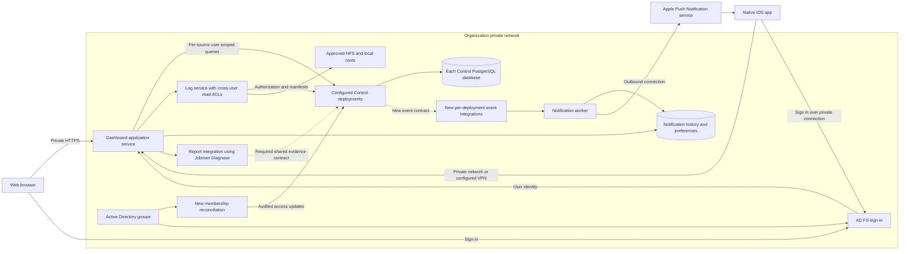

# Jobman Dashboard initial requirements

Status: Draft 0.5 with confirmed first-release scope, development model, and device ownership  
Updated: October 3, 2026  
Decision owner: Ryan Wallace

Implementation design: [First-release design and work plan](DESIGN.md)

Jobman Dashboard will let people monitor Jobman work from a web browser and an iOS application. It should answer three practical questions: what is happening, what needs attention, and what evidence explains the current state.

This document records the agreed product boundaries and proposes acceptance criteria, integration work, and development milestones. The first release includes workload groups, diagnosis reports, all discussed alert scopes, aggregation across Control deployments, and the union of permissions from assigned roles. Confirmed decisions appear below. **Detailed acceptance criteria and implementation choices remain proposals; none of this document claims that Dashboard is already implemented.**

## Confirmed product decisions

| Decision | Confirmed requirement |
| --- | --- |
| Platforms | Provide a web application and an iOS application. |
| D01 Audience | Design for an organization with multiple teams and roles. |
| D02 Initial data source | Monitor Jobman Control deployments first. |
| D03 Job actions | The first release is monitoring only. |
| D04 Monitoring depth | Job lifecycle, logs, outcomes, and evidence freshness first. CPU/GPU/memory utilization and cluster capacity come in a later release. |
| D05 Hosting | Self-hosted on the organization's private network. |
| D06 iOS delivery | A native iOS application, distributed internally. |
| D07 Notifications | First-release background alerts support watched jobs, all of a user's jobs, and selected namespaces, with configurable failure and completion events. |
| D09 Log storage | Support NFS and local filesystem logs first. S3 byte delivery is deferred. |
| D10 Identity and teams | Active Directory is the identity source. Membership in specially created AD groups maps teams to namespaces. |
| D11 Workload groups and diagnosis | Slurm arrays, collections, dependency graphs, and diagnosis reports are available in the first release. |
| D12 Scale and retention | Accept the baseline of 10 namespaces, 25 concurrent viewers, 500 active jobs, 10,000 retained jobs per namespace, and 30 days of notification history. |
| D13 Client scope | iPhone and web in the first release. iPad app support comes later. |
| D14 Development model — confirmed portion | Ryan and Codex will develop the application together, with Codex performing most hands-on implementation. Pilot timing, hosting resources, and production maintenance ownership remain unspecified. |
| D15 Organizational views | Provide namespace switching and an aggregate view across the user's authorized namespaces. |
| D16 Sign-in service | Use AD FS as the federation/sign-in service for Active Directory users. |
| D17 AD group mappings | One-to-one mappings between dedicated AD groups and namespace-scoped roles. Only direct membership counts; nested groups are excluded. |
| D18 Device ownership — confirmed portion | Production targets company-managed iPhones. Ryan can test on a personally owned phone with no management controls. The internal distribution mechanism and signing ownership remain open. |
| D19 Mobile network access | VPN access to the private network is available. |
| D20 Control deployments | Support one or multiple Control deployments, with aggregation across namespaces within a deployment and across deployments. |
| D21 Log-reader identity | Run the log-reading service as a user with ACL access to all managed log files across workload users. End-user namespace authorization still governs each log request. |
| D22 AD access lifecycle | Access has no scheduled expiry. AD group membership changes revoke the affected access, including for users with existing sessions. |
| D23 Namespace visibility | Members may view everyone's jobs and logs within each namespace they can access. |
| D24 Effective permissions | A user in multiple role groups for the same namespace receives the union of those roles' permissions/capabilities. Evaluate that union separately for each deployment and namespace. |

## Proposed product direction

Build for an organization whose teams use Jobman Control. Deliver the same core monitoring workflows through a responsive web application and a native iOS application distributed internally. Prioritize trustworthy job status, useful logs, and background notifications that let a user step away from a workstation.

The first release monitors jobs without submitting or changing them. It can save user preferences and notification subscriptions. Cancellation, broader job control, standalone Jobman connections, and administrative mutations are outside this release.

Host Dashboard and its supporting services on the private network. Users sign in through AD FS, discover namespaces through the approved direct AD group mappings, and choose one namespace, an aggregate within a Control deployment, or an aggregate across configured Control deployments. Each view contains only the user's authorized resources. Within an accessible namespace, members can read all users' jobs and logs.

The same application must support one or multiple Control services from the first release. Preserve deployment and namespace in resource identities, subscriptions, reports, caches, and deep links. Phones use the available VPN for private services; background push delivery also needs approved connectivity to Apple. Validate private DNS and certificate trust for every configured source. Production targets company-managed iPhones; Ryan's unmanaged personal phone is available for development testing. The internal app-distribution mechanism remains to be identified.

## Existing capabilities and constraints

These findings come from the local projects reviewed on October 3, 2026. They describe repository behavior and documented limitations, not a live deployment assessment.

| Component | Current foundation | Consequence for Dashboard |
| --- | --- | --- |
| Jobman Dashboard | At the initial review, the project contained four SVG branding assets and no application source. This document is the initial requirements artifact. | Web implementation, native iOS framework, and service packaging still need design work. |
| Standalone Jobman | Local, per-user execution and SQLite state; versioned inspection output, logs, retries, dependencies, and lifecycle controls. | A browser or phone needs a new authenticated connector to observe standalone installations. Shared mode does not automatically expose local jobs. See the [Jobman overview](../../jobman/README.md) and [inspection implementation](../../jobman/jobman/list.go). |
| Jobman Control | An HTTP API with OIDC authentication and namespace authorization; job and target reads, collection and graph detail, cancellation, log and artifact manifests. | The strongest existing integration boundary for the first release. The service remains an evaluation release with outstanding production acceptance work. See the [API guide](../../jobman-control/docs/API.md), [HTTP routes](../../jobman-control/internal/httpapi/api.go), and [readiness review](../../jobman-control/docs/PRODUCTION_READINESS.md). |
| AD integration | Control's [authenticator](../../jobman-control/internal/auth/oidc.go) validates issuer, audience, signature, expiry, and subject. It does not interpret AD groups. The [membership implementation](../../jobman-control/internal/store/postgres/memberships.go) stores one role per user/namespace and replaces it when updated. | Add direct-group reconciliation and support for effective permission unions at each Control authorization boundary. The existing single-role model does not implement the agreed policy. |
| Shared logs and artifacts | Control authorizes metadata. Bytes remain in local/NFS or S3 storage; the current CLI reads filesystem log chunks through local mappings. | Web and iOS log viewing requires an authorized byte-access service or scoped object delivery. A manifest alone is insufficient. See [shared mode](../../jobman/docs/SHARED_MODE.md) and [Control architecture](../../jobman-control/docs/ARCHITECTURE.md). |
| Jobman Diagnose | A read-only companion with structured reports, evidence citations, deterministic findings, and optional generated hypotheses. | First-release Dashboard reports require authorized shared-job evidence acquisition, report production/availability, and delivery. The existing local CLI does not establish that integration. See the [overview](../../jobman-diagnose/README.md) and [report contract](../../jobman-diagnose/docs/REPORT_SCHEMA.md). |

The Control contract is currently `jobman.control/v1alpha1`. The reviewed Control checkout was at `4735be5`; the Jobman checkout was at `c0980f3` with local work in progress. Implementation must recheck the chosen versions and contracts before relying on this snapshot.

## Users and primary workflows

The initial audience is an organization with multiple teams and roles. Proposed personas are a team member following work, a team lead monitoring several authorized namespaces, and an operator reviewing operational evidence. A namespace is the existing authorization boundary. Each configured namespace-scoped role maps one-to-one to a dedicated AD group; direct membership grants that role. Membership inherited through nested groups does not grant access. Exact group identifiers remain deployment configuration.

| User need | Successful workflow |
| --- | --- |
| Check work at a glance | Open a namespace overview, see active work and attention items, and open the relevant job. |
| Investigate a problem | Find a job, inspect outcome and scheduler evidence, read its logs, and open the corresponding diagnosis report and cited evidence. |
| Monitor away from a desk | Configure alerts for watched jobs, all own jobs, or selected namespaces; receive matching events and open the correct source job on iPhone. |
| Understand missing updates | Distinguish a disconnected client, unavailable Control service, stale execution evidence, and a confirmed terminal result. |
| Inspect execution destinations | View registered targets, backend and provider, current generation, and configured operating state. |
| Work across teams | Sign in through organizational identity, discover authorized namespaces, switch team context, and receive consistent permissions in both clients. |
| Review aggregate activity | Compare authorized namespaces within and across Control deployments, then drill into work while retaining deployment and namespace context. |
| Inspect grouped work | Browse collections and Slurm arrays, inspect child/task results, and follow dependency graph nodes and their readiness conditions. |

### Roles and visibility

Dashboard must use Control's namespace authorization and the union of permissions conferred by every directly assigned role in that scope. First-release Dashboard workflows remain read-only for jobs even when the union includes capabilities usable through other clients.

| Existing Control role | Proposed Dashboard experience |
| --- | --- |
| `viewer` | Read authorized namespace jobs, targets, and result metadata; read log bytes only through a separately authorized delivery path. Manage personal display and notification preferences. |
| `submitter` | The same monitoring workflows; no submission or cancellation controls in the first Dashboard release. |
| `operator` | Namespace monitoring and, when implemented, the operational/audit views permitted by Control. |
| `namespace_admin` | Namespace monitoring and permitted audit visibility. Membership, policy, enrollment, and target changes remain in existing administration workflows. |

Each namespace member can read all jobs and logs in that namespace. Job ownership is useful for filtering and personal alerts; it does not restrict namespace visibility. Effective permissions are the set union of all directly assigned roles for the same deployment/namespace, with duplicate capabilities counted once. Removing a role removes only capabilities no longer supplied by another role. Do not substitute a guessed highest role for the exact union.

Control must enforce this policy for metadata, groups, reports, log delivery, and notifications. Grants in one namespace or deployment do not confer capabilities in another. The current single-role persistence and role checks require coordinated Control API, authorization, and migration work before the agreed policy can ship.

## Release scope

**MVP** means the agreed first supported product release, including web and native iPhone clients. Internal milestones may deliver subsets; the release includes every confirmed capability below.

| Priority | Included capabilities |
| --- | --- |
| MVP monitoring | AD FS and direct group mappings; permission unions; all-member namespace visibility; one or multiple Control connections; namespace switching; aggregates within/across deployments; paginated jobs; detail; freshness; NFS/local logs; artifact metadata; targets; refresh; deep links; accessible layouts. |
| MVP workload investigation | Slurm arrays, collections, dependency graphs, child/node navigation, and diagnosis reports with evidence citations in both clients. |
| MVP alerts and delivery | Alerts for watched jobs, all own jobs, and selected namespaces; configurable failure/completion outcomes; background iOS delivery; a 30-day inbox; and installation/upgrades through the selected internal iOS channel. |
| Follow-up | Broader text/label search, saved views, full run/event timelines, agent fleet health, utilization and cluster-capacity telemetry, artifact downloads, historical trends, and native iPad support. |
| Separate expansion | Standalone connectors; cancellation and other job mutations; namespace and target administration; S3 log byte delivery; hosted multi-organization service; Android, widgets, and Live Activities. |

CPU, memory, GPU utilization, cluster capacity, cost accounting, scheduler administration, a remote terminal, and an editor for workload definitions are outside the proposed initial scope. Requested resources and observed utilization must remain distinct if resource views are added later.

## Functional requirements

### Access and navigation

| ID | Proposed requirement | Acceptance criteria |
| --- | --- | --- |
| R01 | Connect privately and sign in through AD FS. | A user can identify the deployment, authenticate through AD FS, sign out, and recover from expired credentials. Private-network/VPN failure, authentication, authorization, and incompatible-version failures have distinct useful messages. Production access uses HTTPS with trusted certificates. |
| R02 | Discover authorized namespaces and show effective capabilities. | Users can inspect their assigned roles and effective permission union per deployment/namespace, switch scope, and view all members' jobs/logs there. AD changes update access for existing sessions. Scope changes cannot expose another account's data. Grants have no scheduled expiry; no shared administrator identity bypasses permissions. |
| R03 | Provide equivalent core navigation on web and iPhone. | Both clients expose Overview, Jobs, Collections/Arrays, Graphs, Targets, Notifications, and Settings; diagnosis is reachable from job detail. A scope selector supports namespaces, deployments, and authorized aggregates. Deep links retain source identity through sign-in. Unreachable sources produce a recovery path. |

### Job monitoring

| ID | Proposed requirement | Acceptance criteria |
| --- | --- | --- |
| R04 | Show an accurate namespace overview. | Show active jobs, jobs awaiting execution, terminal results, and attention items. Every count states its scope and time window and agrees with the corresponding filtered result. Partial pages never masquerade as namespace totals. An unavailable query displays unavailable, not zero. |
| R05 | Provide a bounded job inventory. | Browse newest-first pages, filter by phase and the overview's outcome/time criteria, open a full job ID directly, and retain list position when returning from detail. Rows show name/ID, target, phase, outcome when present, and freshness. No full-history download is required. Outcome/time filters require a Control API extension. |
| R06 | Present factual job detail. | Show deployment/namespace, ID/name, submitting owner, labels, group/node membership, target/generation, backend, created/updated times, desired state, phase/outcome, confidence, and scheduler evidence when available. Link logs and diagnosis reports. Missing source fields remain unavailable until the required API exists; `updatedAt` does not stand for a lifecycle time or heartbeat. |
| R07 | Preserve lifecycle meaning. | Job phase, terminal outcome, cancellation intent, scheduler state, and observation confidence remain separate facts. Stale evidence does not become “failed”; cancellation requested does not become “cancelled.” Unknown enum values remain inspectable without crashing. |
| R08 | Refresh predictably and recover from disconnection. | Both clients support explicit refresh and bounded foreground polling. Each view shows when it last fetched successfully; job evidence shows its own freshness separately. A failed refresh preserves an explicitly stale view. Returning to the foreground triggers a fresh authorized read. |
| R09 | Display NFS/local logs safely and incrementally. | The server runs as an ACL-enabled service user able to read managed logs across workload users. Before serving any bytes, authorize the requesting user for the namespace/job. Send bounded content over HTTPS; clients need no NFS credentials. Support stdout/stderr tails, pause/resume following, and loaded-text search. Preserve per-stream order, verify lengths/checksums, escape untrusted content, and disclose missing, truncated, or unavailable data. |
| R10 | Expose artifact metadata. | List authorized published artifacts with name, size, checksum, and publication time. Metadata is distinguishable from downloadable content. An inaccessible object does not imply an empty artifact list. Downloads are a follow-up unless explicitly promoted. |
| R11 | Show target configuration without inventing health. | Display target name, backend/provider, current generation, configured state, and available capabilities. “Active” means enabled in policy; it does not prove that an agent is connected or healthy. Agent last-seen and utilization views require additional data. |

For R04, “active” means any nonterminal Control phase. The awaiting-execution subset contains `accepted`, `assigning`, and `accepted_execution`, meaning execution has not yet been reported running. Attention indicators separate unsuccessful terminal results in the selected time window from nonterminal jobs with stale, uncertain, or lost observation confidence. Overlapping indicators must not be presented as disjoint totals. Proposed terminal-result window: the last 24 hours by actual completion time. This needs additional API support.

For R07, the current shared phases are `accepted`, `assigning`, `accepted_execution`, `running`, and `terminal`. Observation confidence is `current`, `stale`, `uncertain`, or `lost` when supplied. Absence of a confidence field means unavailable. Standalone lifecycle values need their own explicit mapping if that mode is added.

### Notifications and preferences

| ID | Proposed requirement | Acceptance criteria |
| --- | --- | --- |
| R12 | Support every agreed alert scope in the first release. | Configure rules for individually watched jobs, all jobs submitted by the signed-in user, and all jobs in selected authorized namespaces. Rules can cover namespaces from one or several deployments and include current and future matching jobs. Choose individual terminal outcomes, unsuccessful outcomes, or all terminal outcomes, including optional success/completion alerts. Edit/disable rules from either client and control delivery per device. |
| R13 | Deliver notifications with durable history. | A server records matching events and attempts delivery when the app is closed. Use deployment-qualified event identity to deduplicate retries and overlapping rules into one inbox event per user/source event. Preserve matched-rule context, event time, and source. Retain notification history for 30 days. Push opens a fresh authorized read; missed or disabled push leaves the inbox usable. |
| R14 | Respect disclosure and access changes. | Default push text contains a generic status message, without commands, logs, paths, or job names. Authorization is checked before sending and when opening detail. Sign-out removes that device's account binding; revoked membership stops future delivery. Already delivered OS notifications cannot be recalled as an access-control mechanism. |
| R15 | Provide useful personal settings. | Users can choose display timezone, appearance, refresh behavior within operator bounds, and notification preferences. Times include a timezone and can expose UTC. Preferences are separated by account/deployment; secrets are never part of preference exports. |

For attention indicators and notification presets, unsuccessful outcomes are proposed as `failure`, `timed_out`, `aborted`, and `lost`. Users can select these individually, opt into successful completion, select cancellation, or select all terminal outcomes. A confirmed cancellation remains its own outcome. Notification subscriptions remain opt-in; adding a Control connection does not subscribe the user automatically.

“All my jobs” uses the authoritative submitting principal recorded by each Control service. Identity must be mapped to the signed-in user through verified issuer/subject information, not display names or email matching. Owner metadata and matching queries are required API additions. Namespace-wide alerts include other users' jobs in those namespaces. Rules apply to future eligible events without importing an entire old history as new alerts. Permission loss removes the affected scope from evaluation and pending delivery. The first release covers the alert scopes and outcome options listed here; resource-usage alerts follow the deferred telemetry capability.

Background monitoring must run on a server. iOS background execution is limited, so continuous phone polling cannot be the basis of reliable alerts. Apple push delivery is an additional delivery channel; the authorized inbox and refreshed job state remain authoritative. See Apple's [background execution guidance](https://developer.apple.com/documentation/uikit/extending-your-app-s-background-execution-time) and [remote notification architecture](https://developer.apple.com/documentation/usernotifications/setting-up-a-remote-notification-server).

### Organizational integration

| ID | Proposed requirement | Acceptance criteria |
| --- | --- | --- |
| R16 | Map direct AD roles and calculate their permission union. | Preserve one-to-one group-to-role mappings with explicit deployment/namespace scope. Only verified direct membership grants access. Effective capabilities are the union of all applicable roles; recompute on grant removal and retain overlapping capabilities. Audit source grants and effective changes. Active clients and notifications use the same server-enforced result. Grants have no scheduled expiry. |
| R17 | Aggregate within and across Control deployments. | Support one namespace, all authorized namespaces in a selected deployment, and authorized namespaces across selected deployments. Use consistent metrics/windows, per-source breakdown, and source-qualified drill-down. Count each child/node job once without also counting its collection/graph wrapper as a job. Show completeness and per-source observation times; unavailable sources are partial, never zero, and unauthorized scopes reveal no names/counts. |
| R18 | Deliver and maintain an internal native iOS app. | Install, authenticate, receive background alerts, follow private job links, and upgrade on a real company-managed iPhone through the selected internal channel. Ryan's unmanaged personal phone supports earlier development testing. Record signing/APNs ownership, certificate and profile renewal, supported devices, managed configuration where available, and the organization's app removal process. |

R16 uses direct group membership only. Several roles in one namespace produce an exact permission union, and removing one grant preserves capabilities still provided by another. A one-to-one group-to-role mapping does not limit a person to one assigned role. Group administration stays in AD and operator workflows; Dashboard does not add a membership editor. Dashboard's first-release monitoring-only surface remains unchanged by a user's broader Control permissions.

Membership updates must be discovered while users remain signed in; checking groups only at login does not satisfy D22. Recheck queued notifications and subsequent log requests against updated access, and remove revoked data from active views. Document directory-to-Control propagation and directory-failure behavior during implementation. Incomplete membership data must not be treated as a verified empty list. These update mechanics do not introduce scheduled expiry of access grants.

R17 must work with one and multiple Control deployments. Identify the deployment and namespace of every item, including when separate deployments reuse a namespace name or job ID. Label all-source views by their authorized scope and display partial results when a source is unavailable or incompatible. Global operational metrics are not a substitute for authorized aggregates.

### Groups and diagnosis

| ID | Proposed requirement | Acceptance criteria |
| --- | --- | --- |
| R19 | Browse collections and Slurm arrays. | Discover groups in the selected scope; show aggregate child status, concurrency/failure policy, array identity where applicable, and bounded child/task lists. Preserve array task-index to Jobman job mapping. Open a child job's detail, logs, and diagnosis from either client. Every group and child retains source deployment/namespace. |
| R20 | Inspect dependency graphs. | Discover graphs, inspect node status and edge predicates, and identify satisfied, waiting, or unsatisfied dependencies. Preserve reported blocked/skipped dispositions. Navigate from nodes to ordinary job views. Provide an accessible list alternative and bounded rendering for large graphs. Graph authority stays with the source Control service. |
| R21 | Make diagnosis reports available. | Open a report for an authorized job/run, with findings, severity, confidence basis, suggested actions, retry advice, missing evidence, provenance, and citations. Validate it against its exact source evidence and qualify it by deployment/namespace. Show absent, pending, failed, or outdated reports explicitly. Suggestions never execute or alter jobs. |
| R22 | Operate across independently configured Control services. | Support an operator-approved connection registry with stable deployment IDs, endpoints, trust/audience settings, compatible API versions, and store mappings. Query each using that user's authority. Isolate credentials, cursors, cache entries, errors, and reconnection by source. One failing deployment must not prevent inspection of healthy deployments. |

Group summaries need complete server-derived counts even when only one page of children or nodes is loaded. Group catalogs, filters, child pages, and graph views must stay bounded for large arrays and graphs. Cross-deployment aggregation preserves each source graph's boundary and does not change execution dependencies.

The proposed report workflow retrieves an existing valid report or offers an on-demand, read-only deterministic analysis of a supported shared-job evidence snapshot. An authorized evidence acquisition and report-production path is required for release; a report placeholder alone does not fulfill R21. Core/agent evidence acquisition and Jobman Diagnose interpretation retain their existing ownership boundaries. Shared evidence may require a compatibility adapter or versioned contract extension rather than treating a shared ID as a local SQLite job.

Reports containing optional generated hypotheses must label them and preserve evidence/disclosure provenance. Viewing a report never starts a model call. Automatic or on-demand AI-provider invocation through Dashboard has not been selected; the initial integration proposal uses deterministic generation and can display validated reports that already contain optional generated content.

## Platform requirements

| Web application | iOS application |
| --- | --- |
| Responsive desktop, tablet, and phone layouts; proposed compatibility with current and previous major Safari, Chrome, Edge, and Firefox releases, confirmed at release planning. | A native iOS application distributed internally, initially designed for iPhone. Use system authentication, secure credential storage, and native notification/deep-link handling. Swift with SwiftUI is a proposed implementation; minimum iOS version remains open. |
| Keyboard navigation, visible focus, screen-reader labels, shareable routes, and useful browser back/forward behavior. | VoiceOver, Dynamic Type, adequate touch targets, and legible light/dark appearance. Native iPad support is deferred to a later release. |
| Pause or reduce polling in hidden tabs and prevent overlapping refreshes. | Suspend foreground polling when inactive, reconnect after network changes, and keep memory/network use bounded during log viewing. |
| Do not persist sensitive API responses through browser or service-worker caches by default. | Do not persist job/log content offline by default. An interrupted foreground session may retain clearly stale in-memory metadata; relaunch can require connectivity. |

Both platforms must distinguish loading, empty, filtered-empty, access denied, removed/unavailable, incompatible version, and disconnected states. The iOS delivery decision is native and internal; the exact Apple distribution channel and native UI framework remain implementation choices.

### Private network and internal distribution

Dashboard, Control, the log-access service, and persistent preferences/inbox state run on the private network. Use the available VPN for remote phone access and validate reachability of Dashboard and AD FS, private DNS, and certificate trust. When the phone cannot reach that network, retain a generic notification and explain that job detail requires VPN/private-network reconnection. Do not expose a public Dashboard endpoint as an implicit fallback.

Background alerts require the notification server and devices to reach APNs. Apple documents the required connectivity in its [APNs network guidance](https://support.apple.com/en-us/102266). Private hosting therefore includes an outbound push-service dependency; no public inbound Dashboard route is required by the proposed design. Validate the network policy and proxy behavior during the integration proof. Push payloads contain only a generic message and opaque identifiers; job details stay behind authenticated private endpoints.

Use the organization's approved internal app-distribution channel. Apple's options include custom apps restricted to specified organizations and in-house distribution under its Enterprise Program; internal distribution alone does not select a program. Confirm the existing Apple account and device-management arrangements before choosing packaging and signing. See Apple's [business app distribution guidance](https://developer.apple.com/business/get-started/).

Company-managed iPhones are the production target. Ryan's personally owned, unmanaged iPhone is available for development testing as signing and network access become available. Record that testing separately from acceptance on the organization's actual managed devices and distribution channel. APNs connectivity, credentials, and operating ownership remain unknown; personal-device availability does not settle those infrastructure inputs.

## Integration requirements and missing APIs

The [authored OpenAPI contract](../../jobman-control/api/openapi-v1alpha1.yaml) and [current handlers](../../jobman-control/internal/httpapi/api.go) expose a useful foundation, but several product requirements need new interfaces.

| Product need | What is available now | Work needed before the feature can ship |
| --- | --- | --- |
| Job browsing and ownership | Namespace list/detail, phase filtering, and newest-first pagination; default 50 and maximum 200 jobs per page. Current public job snapshots do not expose the submitting owner. | Add outcome/time queries, authoritative submitter identity, and matching support for “all my jobs” rules. Namespace visibility remains all-member. Broader text/label search is follow-up work. |
| Sign-in and namespace selection | Bearer-token validation and stored namespace roles; the CLI uses an externally supplied token. | Integrate AD FS and both clients; add authorized user, namespace, role-set, and capability discovery per Control deployment. Verify native authorization-code/PKCE, stable subject mapping, and the expected access-token audience/type for each source. |
| AD groups and permission union | Membership updates replace the single stored role; repository authorization checks that role. No group mapping or membership-removal HTTP route is present. | Add direct-group reconciliation, multiple contributing grants, and exact capability union, including audited removal that preserves overlapping grants. Update schema/API/authorization together and publish compatible migration/version requirements. |
| Namespace and aggregate overviews | Current job snapshots, created/updated times, and namespace-scoped reads. No cross-Control aggregation service exists in the reviewed API. | Add authorized summaries, outcome/time filters, and lifecycle timestamps. Dashboard must compose per-source results with stable identities, bounded queries, cursor isolation, completeness, and independent failure handling. |
| NFS/local log viewing | Authorized logical chunk manifests, offsets, sizes, checksums, and capture status. | Add authenticated HTTPS byte delivery under the confirmed service user with ACL access across workload users. Verify approved roots, directory traversal, and access to newly created log chunks. Apply end-user namespace authorization before reading or serving a requested object. |
| Groups and dependencies | Collection and graph detail by known ID; array and node facts exist in the execution/group model. | First-release work includes discoverable group catalogs, job-to-group/node associations, array task mapping, complete summary counts, and bounded child/node/dependency queries. Preserve source graph boundaries when aggregating deployments. |
| Target and agent health | Target configuration and job-level observation confidence. | Expose an authorized agent/target health summary before showing heartbeat, connection, or fleet-health claims. |
| Notifications and live updates | Current snapshots and internal event/outbox state; no exposed client event stream, notification API, or outbox publisher. | Add durable per-source event consumption, all agreed rule scopes, owner matching, rule-overlap deduplication, device registration, delivery, and 30-day history. Recheck authorization while users are offline. |
| Diagnosis | Local sealed evidence/report contracts and a read-only companion; no Dashboard shared-report delivery path. | First-release work includes shared-job evidence acquisition, compatible deterministic report production, authorized retrieval, source/run association, and citation validation. Store original evidence/report identities intact within source-qualified records. |

Control's Prometheus metrics include service-wide counts and are unauthenticated. They must not be used as a shortcut for user-facing namespace counts. Browser cross-origin access also needs an intentional deployment design; the reviewed HTTP middleware does not supply a browser CORS policy.

### Proposed service boundaries

The candidate below supports one or multiple configured Control deployments. It is a design proposal, not a committed technology stack; each Control keeps its own authoritative database and execution scope.

Dashboard owns presentation, source connections, sessions, preferences, notification delivery, report access, and the approved log-access component. Each Control retains job authority and namespace authorization; Jobman agents retain execution and core evidence collection, and Diagnose retains interpretation. Dashboard must not read Control databases directly, mutate Jobman's SQLite files, or run scheduler commands.

A small application service is the proposed integration point for browser sessions and shared mobile APIs. It must forward the user's authority or use an explicitly designed delegated authorization contract. A generic privileged service account is not an acceptable substitute. Log delivery may be a colocated component or a separate service; keep bulk bytes outside Control's metadata API and PostgreSQL.

Every request and durable reference must retain an operator-assigned stable deployment identity. An endpoint URL can change without changing resource identity; connecting a different Control store must not silently reuse the former identity. Qualify store mappings by deployment, logical store, and mapping version. Separate source audiences/credentials and verify principal mapping; a token for one source must not be sent to another merely because namespace names match. Allowlist configured endpoints and keep credentials out of links and source metadata.

Query sources with bounded concurrency, preserve source cursors, and make partial aggregates explicit. Authentication/version/network failure at one source leaves other authorized sources usable. Reconnection resumes source-specific notification processing without generating duplicate inbox entries. A disconnected source does not prove its jobs failed.

For NFS/local logs, run the log-reading service as the designated user with read ACLs across all managed logs. Configure traversal access to the approved directories and ensure access also applies to newly created directories/chunks. This filesystem authority does not expand a Dashboard user's namespace permissions: every request still resolves an authorized job and manifest before serving bytes. A host-local store must be reachable by a colocated service or another approved arrangement. Missing mappings and permission failures remain visible.

Future standalone support would need an opt-in host connector using supported Jobman interfaces, authenticated clients, and stable local job identity. Completed-history import does not provide live monitoring. This connector is outside the confirmed first-release boundary.

## Security and data handling

Active Directory is the identity source and AD FS is the confirmed sign-in service. Microsoft documents AD FS support for [OIDC and native application flows](https://learn.microsoft.com/en-us/windows-server/identity/ad-fs/overview/ad-fs-openid-connect-oauth-flows-scenarios). Confirm the deployed AD FS version and issuer, native authorization-code/PKCE support, stable subject mapping across clients, group data source, and token audiences/types during the integration proof. Compatibility with the current Control verifier requires a real token-contract test; selecting AD FS does not establish that compatibility by itself.

The native app should use authorization code flow with PKCE through a system browser authentication session, consistent with [OAuth for native apps](https://www.rfc-editor.org/rfc/rfc8252). API calls must use access tokens intended for the receiving API; sign-in ID tokens must not become general API credentials. Adapt Control's verifier if the approved AD FS access-token contract requires it. Web sessions must address token storage, expiry, logout, and CSRF if cookies are used. Both clients delegate authentication to AD FS; Dashboard does not collect or store AD passwords.

Authorization applies to metadata, workload groups, every log/object request, evidence/reports, notifications, and persistent preferences. New endpoints must enforce the effective permission union separately within each source namespace. Namespace members can read all members' jobs/logs there. An object path or signed URL must never become an unbounded grant; constrain identity, object, lifetime, and deployment. Operator-configured store mappings must prevent arbitrary URL/path fetching.

Treat labels, scheduler reasons, job metadata, logs, and diagnosis text as untrusted content. Do not execute embedded commands or render arbitrary HTML. Commands and logs can contain secrets; minimize default disclosure, avoid sensitive values in telemetry, and do not claim that escaping or redaction makes arbitrary logs secret-free.

Keep credentials in platform-appropriate secure storage. Do not ship database, store, APNs, or client-secret credentials in either client. Scope caches by account, deployment, and namespace; honor Control's `no-store` policy and clear sensitive local state on logout. Persistent offline data remains a separate retention/device-protection decision. Report generation and evidence access must preserve Diagnose's disclosure and validation boundaries.

If mutations are later approved, require server authorization, clear target identification, explicit confirmation for destructive actions, idempotency, pending-result recovery, and audit history. Do not offer pause/resume/rerun solely because standalone Jobman supports them; shared mode has a different capability set.

## Quality requirements and release acceptance

The scale and notification-retention baseline has been accepted. The other targets below are proposed engineering acceptance criteria, not measured capabilities or service guarantees.

| Area | Proposed target and evidence |
| --- | --- |
| Accepted scale | 10 namespaces, 25 concurrent viewers, 10,000 retained jobs per namespace, and 500 active jobs. Exercise the baseline with one Control and with work distributed across at least two Controls. Working test interpretation: these are totals across the configured source set, with retained history measured per namespace. Record any larger per-deployment rollout needs during capacity planning. |
| Accepted notification retention | Retain inbox/history entries for 30 days. Keep subscriptions and source-processing checkpoints independently of inbox expiry. Job/history/log retention remains owned by Control and the stores; the 10,000-job figure is a capacity target, not a Dashboard deletion rule. |
| Responsiveness | At the agreed scale, the first useful authenticated list/detail view renders within 2 seconds at p95 on the agreed test devices with network RTT at most 100 ms. Exclude interactive identity-provider time and measure it separately. |
| Freshness | Foreground job changes appear within 10 seconds at p95 after Control exposes the new state; start with 5-second polling. Show refresh failure promptly and use bounded backoff with jitter. This does not promise scheduler-to-Control latency. |
| Logs | Start with a 256 KiB tail per selected stream and a 2 MiB in-memory rendered buffer; use incremental loading. Validate usability against truncated streams and large chunks before fixing limits. |
| Groups and source fan-out | Bound child/node pages, graph rendering, concurrent source requests, and retry queues. Summaries remain complete for their declared scope; visible rows alone do not determine totals. Test large arrays/graphs and a slow or unavailable source on both clients. |
| Notifications | Persist the notification and attempt APNs handoff within 30 seconds at p95 after an eligible durable event becomes available. Measure handoff separately from device presentation; OS delivery is not guaranteed by this target. |
| Group access correctness | Verify direct membership and exact permission union; nested membership grants nothing. Remove one role and preserve overlapping permissions from another; remove the last applicable role and revoke scope access for existing sessions/notifications. No scheduled access expiry. Measure propagation and test directory outages/incomplete responses. |
| Accessibility | Target [WCAG 2.2 AA](https://www.w3.org/TR/WCAG22/) for web workflows and equivalent native accessibility checks. Verify primary tasks by keyboard and screen reader; status meaning must not rely on color alone. |
| Compatibility | Publish a tested Dashboard/Control contract matrix. Test both clients against shared contract fixtures, handle additive fields, and show an actionable message for unsupported versions. |
| Operations | Document private installation, TLS/OIDC and AD group setup, NFS/local ACLs, APNs connectivity, internal iOS installation/upgrades, and backup/restore for new durable state. Assign signing and push credential renewal owners. Record safe errors and freshness/delivery metrics without job content. |

Before release, demonstrate these scenarios in both clients where applicable:

1. An authorized user opens a namespace, follows a job through completion, and reads its stdout and stderr.
2. A failed job, a stale running job, and a disconnected client remain visibly distinct.
3. Pagination and overview totals agree with a known dataset. Single-namespace, per-deployment, and cross-deployment aggregates count child/node jobs once. Duplicate names/IDs across sources remain separate; unavailable sources show partial results without invented counts or timestamps.
4. Direct mapped memberships grant the exact permission union; nested memberships grant nothing. Members can read another user's jobs/logs in their namespace but no data outside their authorized scope. Deep links, reports, notifications, and caches preserve the same boundary across deployments.
5. Removing one role group removes only permissions absent from remaining roles; removing the last grant revokes namespace access without requiring a new sign-in. Active views, reads, and notifications respect the update. Test expiry, logout, reconnect, directory failure, and incompatible source versions. Dashboard remains monitoring only for every role.
6. The ACL-enabled service reads existing and newly created logs owned by different workload users, while an end user cannot retrieve another namespace's logs. Truncation, corrupt chunks, unavailable storage, unknown status values, and large output cannot freeze the client or produce misleading success.
7. An internally installed native app receives a background alert on a real iPhone. Disabled/delayed push still leaves one durable inbox event. Opening it rechecks access and, when disconnected from the private network, explains the connection requirement.
8. The chosen internal channel installs and upgrades the app on a company-managed iPhone with valid signing and push configuration. Private DNS, certificate trust, the intended on-site/VPN routes, and outbound APNs connectivity work under the organization's actual network policy.
9. Browse an actual collection, Slurm array, and dependency graph; map child/task/node results to jobs, logs, and reports. Large groups remain navigable without loading/rendering the entire dataset.
10. Produce and display a valid diagnosis report from a representative failed shared job, follow authorized citations, and distinguish missing/outdated evidence and optional generated content. Recommendations cannot execute job changes.
11. Exercise watched-job, all-own-job, and namespace rules across multiple sources for selected unsuccessful, success, cancellation, and all-terminal events. Overlapping rules and replay produce one inbox entry per user/source event. Verify new matching jobs, access removal, 30-day history expiry, and disabled push.

Control's documented production acceptance work remains a dependency for production deployment. A working Dashboard pilot does not establish production readiness of the underlying execution infrastructure.

## Decisions for Ryan

Product scope is confirmed above. D08 remains open; D14 and D18 are partially resolved by the confirmed development model and device ownership. Internal iOS distribution remains explicitly open. Detailed acceptance targets and implementation proposals still require design validation.

| Decision | Confirmed status and remaining input | Proposed starting point |
| --- | --- | --- |
| D08 Push operations | Unknown for now: permission for outbound Apple connectivity, Apple application identity/APNs credential owner, and notification-service operator. | Develop event processing and delivery integration with test fixtures while collecting these inputs; verify actual APNs delivery before release. |
| D14 Delivery constraints | Confirmed: Ryan and Codex will develop together, with Codex doing most hands-on implementation. Still unspecified: first-pilot date, private hosting capacity/budget, and production maintenance ownership. | Plan incremental implementation and review around Ryan and Codex. Establish dates from integration evidence; identify a production operator before deployment. |
| D18 Internal app distribution | Confirmed: company-managed production phones, with Ryan's unmanaged personal phone available for testing. Still unknown: existing Apple accounts, MDM, approved distribution channel, signing owner, and update/removal process. | Use the personal phone for development checks when prerequisites are available; verify final installation and upgrades on company-managed phones through the selected internal channel. |

D08 and the unresolved portion of D18 remain infrastructure items for the network and device-management owners. They can remain open while application development proceeds, but actual push delivery and managed-device distribution must pass release acceptance. D14 now establishes the development model; timing, hosting, and ongoing operation remain separate inputs. The adopted feature scope must be reflected in estimates and milestones rather than treating groups, diagnosis, or multiple sources as optional work.

### Integration details to collect

These are implementation inputs under the confirmed decisions, not proposals to reopen hosting or platform scope.

- AD FS version, discovery issuer, web/native application registrations, API audiences/token types, subject and group claims, and approved directory access for ongoing membership reconciliation.
- Dedicated AD group identifiers, deployment/namespace/role bindings, direct-membership evidence, and ownership of the mapping. Effective permissions are the confirmed union; design must implement it consistently in Control.
- Existing Apple accounts and MDM/distribution arrangements, signing/APNs ownership, company-managed device inventory, Ryan's personal test-phone model/iOS version, and update/removal process.
- VPN routes, internal DNS names, certificate trust provisioning, and approved APNs egress for servers and phones.
- NFS exports and local log locations, mapping versions, service placement, the designated cross-user ACL-enabled log-reader identity, permissions on new files/directories, and the first representative workload.
- Control deployment registry, source-specific trust/audience settings and store mappings, supported versions, submitter-identity exposure, and fixtures that distribute the agreed capacity across multiple sources.
- Shared-job evidence and report-production contracts; initial proposal is on-demand deterministic analysis. AI-provider invocation remains separate from displaying diagnosis reports. Minimum iOS version and persistent offline storage are still implementation/product details to settle; iPad support is already deferred.

## Proposed development milestones

| Milestone | Reviewable outcome |
| --- | --- |
| Requirements agreement | Record concrete groups, source registry, log-reader identity, and delivery ownership. Keep internal iOS distribution open until IT confirms the mechanism. Select representative single jobs, arrays, collections, graphs, and failures from at least two Control sources. |
| Integration proof | Web and native iPhone authenticate through AD FS over VPN. Demonstrate permission union and revocation, per-source and cross-source aggregates, NFS/local logs, a valid shared-job diagnosis, and a real APNs alert. Verify token/identity contracts for both Control sources. |
| Required backend contracts | Deliver Control authorization/schema changes for role unions, discovery/summary/owner/group APIs, shared evidence/report integration, authorized byte delivery, and durable source events. Version and test the contracts before client integration is treated as complete. |
| Monitoring implementation | Deliver all agreed scope selectors, aggregates, jobs, arrays/collections, graphs, diagnosis, targets, logs, artifact metadata, navigation, and accessibility in both clients. |
| Notification and pilot acceptance | Complete all alert scopes/outcome selectors, overlap deduplication, 30-day inbox history, and internal iOS install/upgrade. Exercise source outages, role changes, large groups, and the agreed load envelope with real users and jobs. |
| Release planning | Confirm production dependencies, supported versions, distribution, operating ownership, and follow-up scope based on pilot findings. |

Implementation estimates should follow the integration proof. The main dependencies are Control's permission-union model, source discovery/aggregation, group navigation APIs, shared-job diagnosis, log delivery, and notification/event services. These are first-release requirements and must be included in the delivery plan.

Codex will perform most hands-on development with Ryan collaborating on decisions, review, and available device testing. Proceed through small, tested implementation slices; infrastructure-dependent proofs remain tracked until the required access and credentials are available. No pilot date, hosting allocation, or production maintenance owner has been committed yet.
